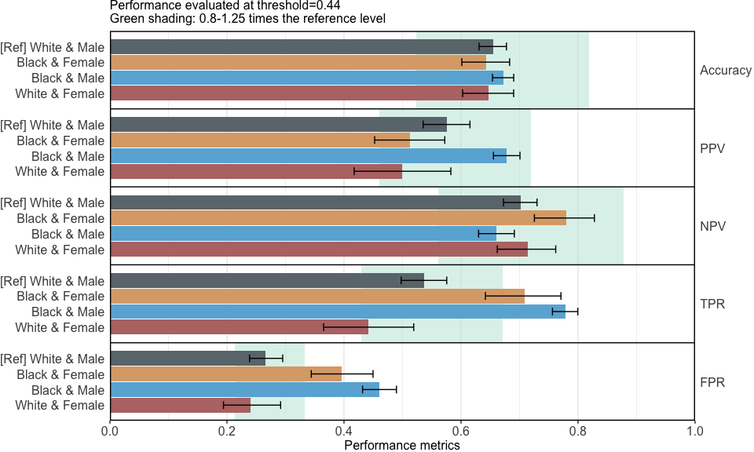
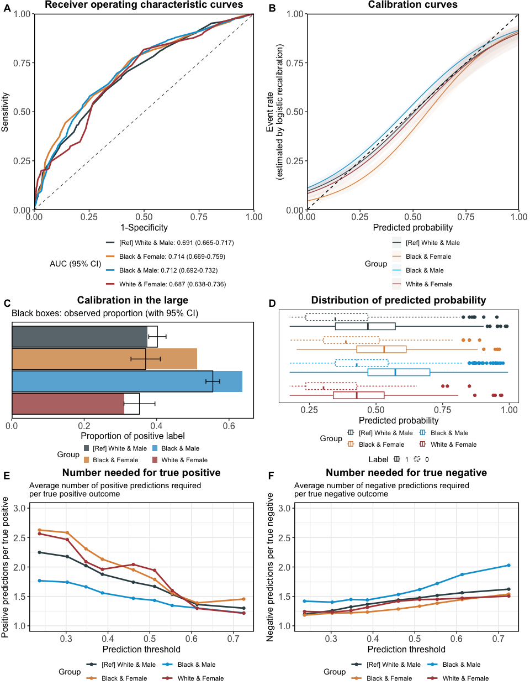

Case Study 1: Intersectional Bias in Recidivism Prediction
================

- [Build prediction model](#build-prediction-model)
  - [Prepare data](#prepare-data)
  - [Build logistic regression model](#build-logistic-regression-model)
- [Fairness evaluation](#fairness-evaluation)
  - [Compute fairness metrics](#compute-fairness-metrics)
  - [Visualise fairness metrics](#visualise-fairness-metrics)

This guide book completely reproduces Case Study 1 in the paper
*seeBias: A Comprehensive Tool for Assessing and Visualizing Fairness in
AI Prediction Models*, which evaluates bias across race and sex when
predicting two-year recidivism using the COMPAS data.

## Build prediction model

The COMPAS data is sourced from the
[*fairmodels*](https://fairmodels.drwhy.ai/) R package and also provided
in the *seeBias* package.

``` r
library(seeBias)
library(dplyr) # to manipulate data
## 
## Attaching package: 'dplyr'
## The following objects are masked from 'package:stats':
## 
##     filter, lag
## The following objects are masked from 'package:base':
## 
##     intersect, setdiff, setequal, union
library(tableone) # to describe final dataset
library(knitr) # to format tables
## Warning: package 'knitr' was built under R version 4.3.3
library(ggplot2) # to edit figures
library(ggpubr) # to arrange figures
data("compas")
knitr::kable(head(compas))
```

| Two_yr_Recidivism | Number_of_Priors | Age_Above_FourtyFive | Age_Below_TwentyFive | Misdemeanor | Ethnicity        | Sex  |
|:------------------|-----------------:|:---------------------|:---------------------|:------------|:-----------------|:-----|
| 0                 |                0 | 1                    | 0                    | 0           | Other            | Male |
| 1                 |                0 | 0                    | 0                    | 0           | African_American | Male |
| 1                 |                4 | 0                    | 1                    | 0           | African_American | Male |
| 0                 |                0 | 0                    | 0                    | 1           | Other            | Male |
| 1                 |               14 | 0                    | 0                    | 0           | Caucasian        | Male |
| 0                 |                3 | 0                    | 0                    | 0           | Other            | Male |

### Prepare data

Use subset of COMPAS data for Caucasian and African American. Exclude
race and sex from the prediction model.

``` r
dat <- compas %>% filter(Ethnicity %in% c("Caucasian", "African_American"))
dat$Ethnicity <- ifelse(dat$Ethnicity == "African_American", "Black", "White")
```

The COMPAS dataset includes 6172 individuals. We focused on a subset of
5278 White and Black individuals and examined bias across race
(`Ethnicity`) and sex (`Sex`).

``` r
CreateTableOne(vars = names(dat), strata = "Two_yr_Recidivism", 
               data = dat, addOverall = TRUE) %>% 
  kableone(caption = "Supplementary Table S1. Characteristics of individuals analyzed in the prediction of two-year recidivism.")
```

|                              | Overall     | 0           | 1            | p       | test |
|:-----------------------------|:------------|:------------|:-------------|:--------|:-----|
| n                            | 5278        | 2795        | 2483         |         |      |
| Two_yr_Recidivism = 1 (%)    | 2483 (47.0) | 0 ( 0.0)    | 2483 (100.0) | \<0.001 |      |
| Number_of_Priors (mean (SD)) | 3.46 (4.88) | 2.14 (3.47) | 4.94 (5.73)  | \<0.001 |      |
| Age_Above_FourtyFive = 1 (%) | 1096 (20.8) | 734 (26.3)  | 362 ( 14.6)  | \<0.001 |      |
| Age_Below_TwentyFive = 1 (%) | 1156 (21.9) | 496 (17.7)  | 660 ( 26.6)  | \<0.001 |      |
| Misdemeanor = 1 (%)          | 1838 (34.8) | 1113 (39.8) | 725 ( 29.2)  | \<0.001 |      |
| Ethnicity = White (%)        | 2103 (39.8) | 1281 (45.8) | 822 ( 33.1)  | \<0.001 |      |
| Sex = Male (%)               | 4247 (80.5) | 2137 (76.5) | 2110 ( 85.0) | \<0.001 |      |

Supplementary Table S1. Characteristics of individuals analyzed in the
prediction of two-year recidivism.

### Build logistic regression model

In this example, all subjects in the final dataset are used for model
training and evaluation.

``` r
m <- dat %>% select(-Ethnicity, -Sex) %>% 
  glm(Two_yr_Recidivism ~ ., data = ., family = "binomial")
kable(
  cbind(exp(coef(m)), exp(confint(m))), digits = 2, 
  col.names = c("OR", "95% CI (lower bound)", "95% CI (upper bound)"), 
  caption = "Odds ratio (OR) and 95% confidence interval (CI) from the logistic regression model."
)
```

|                       |   OR | 95% CI (lower bound) | 95% CI (upper bound) |
|:----------------------|-----:|---------------------:|---------------------:|
| (Intercept)           | 0.53 |                 0.48 |                 0.59 |
| Number_of_Priors      | 1.18 |                 1.17 |                 1.20 |
| Age_Above_FourtyFive1 | 0.49 |                 0.42 |                 0.58 |
| Age_Below_TwentyFive1 | 2.12 |                 1.84 |                 2.46 |
| Misdemeanor1          | 0.82 |                 0.72 |                 0.92 |

Odds ratio (OR) and 95% confidence interval (CI) from the logistic
regression model.

## Fairness evaluation

Construct the seeBias object, using race and gender as sensitive
variables.

``` r
# Extracted predicted risk and observations from test data.
# If not specified, the best threshold in ROC analysis is used.
x <- dat %>% select(Ethnicity, Sex) %>% evaluate_prediction_prob(
  y_pred = predict(m, newdata = dat, type = "response"), 
  y_obs = dat$Two_yr_Recidivism, y_pos = "1",
  sens_var = ., sens_var_ref = c("White", "Male")
)
## Threshold=0.440 set by ROC analysis.
## Configuring sensitive variables ...
##     4 subgroups based on sensitive variables ('sens_var'): Black & Female, White & Female, Black & Male, White & Male.
##     Reference group: White & Male.
## Configuration completed.
```

### Compute fairness metrics

Table 1 in the manuscript:

``` r
summary(x)
```

| Group          | Sample size | TPR difference | FPR difference | TNR difference | BER difference |
|:---------------|------------:|:---------------|:---------------|:---------------|:---------------|
| White & Male   |        1621 | Reference      | Reference      | Reference      | Reference      |
| Black & Female |         549 | 0.173          | 0.13           | -0.13          | -0.021         |
| Black & Male   |        2626 | 0.242          | 0.194          | -0.194         | -0.024         |
| White & Female |         482 | -0.096         | -0.026         | 0.026          | 0.035          |

Equal opportunity ensures that different groups have the same true
positive rate (TPR), meaning the model correctly identifies positive
cases equally well across all groups. This can be assessed by comparing
the difference in TPR from the reference group across groups.
Differences close to 0 indicate minimal bias.

Equalised odds ensures that different groups have the same true positive
rate (TPR) and false positive rate (FPR), meaning the model is equally
accurate and equally prone to errors across all groups. This can be
assessed by comparing the differences in each group’s TPR and FPR from
those of a reference group across groups. Differences close to 0
indicate minimal bias.

Balanced error rate (BER) equality ensures that the BER is consistent
across different groups. BER is the average of the false positive rate
(FPR) and the false negative rate (FNR, which is 1 minus the true
positive rate \[TPR\]). This means the model’s overall error rate,
considering both false positives and false negatives, is uniform across
all groups. This can be assessed by comparing the difference in each
group’s BER from that of the reference group across groups. Differences
close to 0 indicate minimal bias.

### Visualise fairness metrics

By default, only the figure for performance metrics (Figure 2) is
displayed.

``` r
x_plots <- plot(x)
```

<!-- -->

To save the figure for performance metrics to a PDF file:

``` r
ggsave(x_plots$`Performance metrics`, filename = "output/compas_metrics.pdf", 
       width = 20, height = 12, units = "cm")
```

To format and compile other figures (Figure 3), and save to a PDF file:

``` r
common_theme <- theme(legend.position = "bottom", 
                      legend.box.spacing = unit(0, "lines"))
p_roc <- x_plots$`ROC curves` + common_theme + 
  theme(axis.title.y = element_text(margin = margin(0, 5, 0, 0)))
p_calib <- x_plots$`Calibration curves` + common_theme
p_calib_large <- x_plots$`Calibration in the large` + common_theme +
  guides(
    fill = guide_legend(ncol = 2, title = "Group")
  )
p_score <- x_plots$`Boxplot of predictions` + common_theme + 
  guides(
    color = guide_legend(ncol = 2, title = "Group"),
    linetype = guide_legend(ncol = 2, title = "Label")
  )
p_nnp <- x_plots$`Number needed for true positive` + common_theme + 
  theme(axis.title.y = element_text(margin = margin(0, 5, 0, 0))) + 
  guides(
    color = guide_legend(ncol = 2, title = "Group")
  )
p_nnn <- x_plots$`Number needed for true negative` + common_theme + 
  theme(axis.title.y = element_text(margin = margin(0, 5, 0, 0))) + 
  guides(
    color = guide_legend(ncol = 2, title = "Group")
  )
p_all <- ggarrange(
  p_roc, p_calib, p_calib_large, p_score, p_nnp, p_nnn,
  labels = LETTERS[1:6], font.label = list(size = 14, face = "bold"),
  ncol = 2, nrow = 3,
  heights = c(6, 3.5, 4.5)#, align = "v"
)
p_all
```

<!-- -->

``` r
ggsave(p_all, filename = "output/compas_other_fairness.pdf", 
       width = 23, height = 29.9, units = "cm")
```
