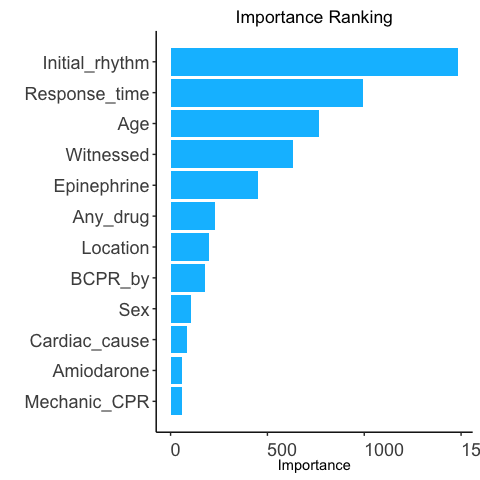
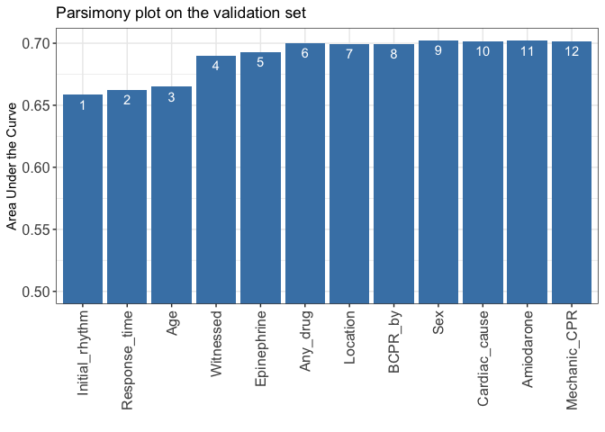
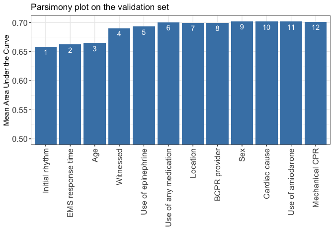
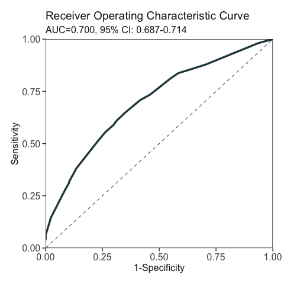
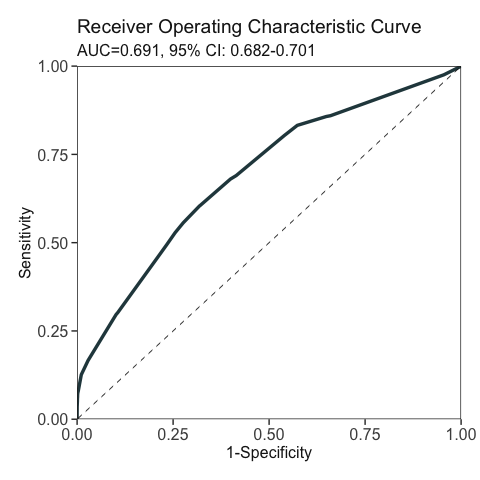
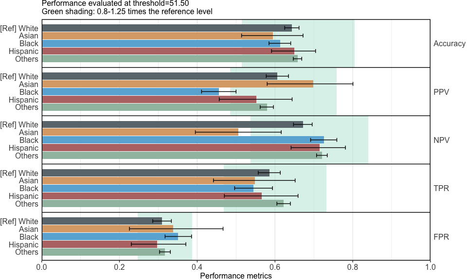
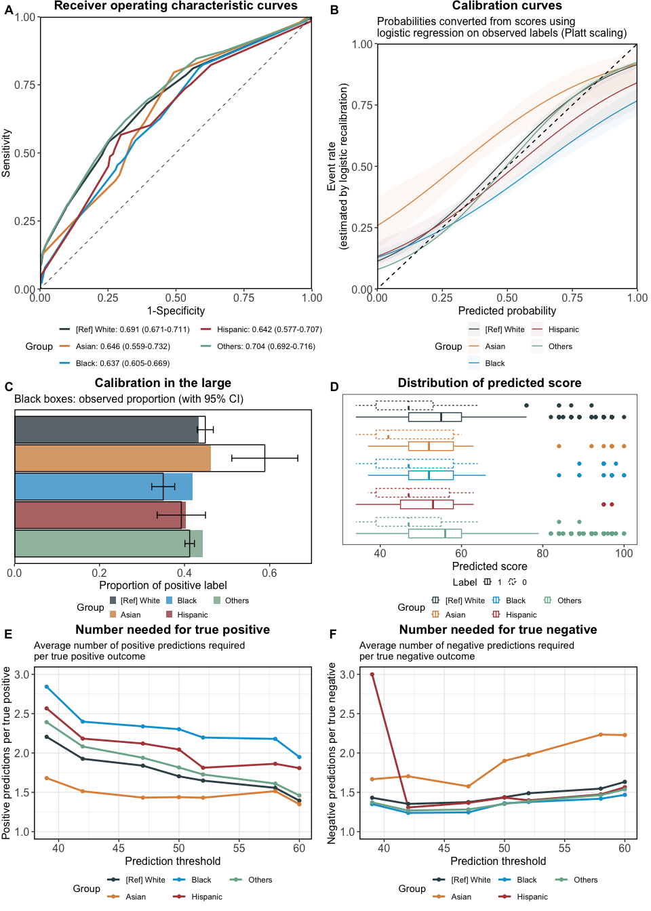

Case Study 2: Clinical Fairness Evaluation in ROSC Prediction
================

- [Build scoring model](#build-scoring-model)
  - [Prepare data](#prepare-data)
  - [Build scoring model using
    AutoScore](#build-scoring-model-using-autoscore)
- [Fairness evaluation](#fairness-evaluation)
  - [Compute fairness metrics](#compute-fairness-metrics)
  - [Visualise fairness metrics](#visualise-fairness-metrics)

This guide book completely reproduces Case Study 2 in the paper
*seeBias: A Comprehensive Tool for Assessing and Visualizing Fairness in
AI Prediction Models*, which evaluates bias across race groups when
predicting return of spontaneous circulation (ROSC) among
out-of-hospital cardiac arrest (OHCA) patients using data from the
Resuscitation Outcomes Consortium (ROC) Cardiac Epidemiologic Registry
(Version 3).

## Build scoring model

The ROC data can be requested from the [NIH
website](https://biolincc.nhlbi.nih.gov/studies/roc_cardiac_epistry_3/#:~:text=The%20ROC%20Cardiac%20Epistry%20version,and%20which%20data%20were%20collected).
In this code book we focus on the development of a scoring model for
ROSC prediction and fairness evaluation of the model, using a subset of
the original ROC data.

``` r
library(seeBias)
library(AutoScore) # to build scoring model
library(dplyr) # to manipulate data
## 
## Attaching package: 'dplyr'
## The following objects are masked from 'package:stats':
## 
##     filter, lag
## The following objects are masked from 'package:base':
## 
##     intersect, setdiff, setequal, union
library(tableone) # to describe final dataset
library(knitr) # to format tables
library(ggplot2) # to edit figures
library(ggpubr) # to arrange figures
```

### Prepare data

Load the final cohort prepared from the ROC data. Based on AutoScore
requirements, ROSC status has been renamed to `label`.

``` r
dat <- readRDS("dat_roc.RDS") 
head(dat)
##   label Age    Sex   Race Cardiac_cause Witnessed   BCPR_by   Location
## 1     0  89   Male Others             1        No   Unknown    Private
## 2     0  60   Male Others             1        No   Unknown    Private
## 3     0  54   Male Others             1        No     Other    Private
## 4     1  68 Female Others             1        No Laypeople Healthcare
## 5     0  89 Female  White             1       Yes Laypeople    Private
## 6     0  74   Male  White             1       Yes Laypeople    Private
##   Initial_rhythm Response_time Any_drug Epinephrine Amiodarone Mechanic_CPR
## 1       Asystole      7.633333        1           1          0            0
## 2       Asystole      6.450000        0           0          0            0
## 3          VF/VT      6.366667        1           1          1            0
## 4       Asystole      5.616667        1           1          0            0
## 5        Unknown      6.000000        1           1          1            0
## 6       Asystole     10.233333        1           1          0            0
# Confirm the data conforms to AutoScore requirements:
check_data(dat)
## Data type check passed.
## No NA in data.
# Generate descriptive table for the final cohort (Supplementary Table S2):
compute_descriptive_table(dat)
```

|                           | Overall       | 0             | 1             | p       | test |
|:--------------------------|:--------------|:--------------|:--------------|:--------|:-----|
| n                         | 58648         | 34264         | 24384         |         |      |
| label = 1 (%)             | 24384 (41.6)  | 0 ( 0.0)      | 24384 (100.0) | \<0.001 |      |
| Age (mean (SD))           | 65.57 (16.70) | 65.57 (16.90) | 65.56 (16.41) | 0.943   |      |
| Sex = Male (%)            | 37500 (63.9)  | 22066 (64.4)  | 15434 ( 63.3) | 0.006   |      |
| Race (%)                  |               |               |               | \<0.001 |      |
| Asian                     | 839 ( 1.4)    | 347 ( 1.0)    | 492 ( 2.0)    |         |      |
| Black                     | 5986 (10.2)   | 4012 (11.7)   | 1974 ( 8.1)   |         |      |
| Hispanic                  | 1521 ( 2.6)   | 912 ( 2.7)    | 609 ( 2.5)    |         |      |
| Others                    | 36970 (63.0)  | 21692 (63.3)  | 15278 ( 62.7) |         |      |
| White                     | 13332 (22.7)  | 7301 (21.3)   | 6031 ( 24.7)  |         |      |
| Cardiac_cause = 1 (%)     | 54709 (93.3)  | 32115 (93.7)  | 22594 ( 92.7) | \<0.001 |      |
| Witnessed = Yes (%)       | 30690 (52.3)  | 14644 (42.7)  | 16046 ( 65.8) | \<0.001 |      |
| BCPR_by (%)               |               |               |               | \<0.001 |      |
| Laypeople                 | 17768 (30.3)  | 9749 (28.5)   | 8019 ( 32.9)  |         |      |
| Other                     | 7368 (12.6)   | 4462 (13.0)   | 2906 ( 11.9)  |         |      |
| Unknown                   | 33512 (57.1)  | 20053 (58.5)  | 13459 ( 55.2) |         |      |
| Location (%)              |               |               |               | \<0.001 |      |
| Healthcare                | 4989 ( 8.5)   | 3150 ( 9.2)   | 1839 ( 7.5)   |         |      |
| Private                   | 44837 (76.5)  | 26947 (78.6)  | 17890 ( 73.4) |         |      |
| Public                    | 8822 (15.0)   | 4167 (12.2)   | 4655 ( 19.1)  |         |      |
| Initial_rhythm (%)        |               |               |               | \<0.001 |      |
| Asystole                  | 26871 (45.8)  | 19659 (57.4)  | 7212 ( 29.6)  |         |      |
| PEA                       | 13960 (23.8)  | 7049 (20.6)   | 6911 ( 28.3)  |         |      |
| Unknown                   | 4519 ( 7.7)   | 2436 ( 7.1)   | 2083 ( 8.5)   |         |      |
| VF/VT                     | 13298 (22.7)  | 5120 (14.9)   | 8178 ( 33.5)  |         |      |
| Response_time (mean (SD)) | 6.16 (3.44)   | 6.22 (3.49)   | 6.09 (3.36)   | \<0.001 |      |
| Any_drug (mean (SD))      | 0.86 (0.34)   | 0.87 (0.33)   | 0.85 (0.36)   | \<0.001 |      |
| Epinephrine (mean (SD))   | 0.83 (0.37)   | 0.87 (0.33)   | 0.78 (0.42)   | \<0.001 |      |
| Amiodarone (mean (SD))    | 0.05 (0.22)   | 0.04 (0.20)   | 0.06 (0.24)   | \<0.001 |      |
| Mechanic_CPR (mean (SD))  | 0.04 (0.20)   | 0.05 (0.21)   | 0.03 (0.18)   | \<0.001 |      |

### Build scoring model using AutoScore

Follow the [standard steps of the AutoScore
framework](https://nliulab.github.io/AutoScore/) to develop the scoring
model. The variable race is only used for fairness evaluation, not in
the scoring model development.

Split the final cohort into training, validation, and test sets:

``` r
set.seed(4)
out_split <- split_data(data = dat, ratio = c(0.7, 0.1, 0.2), 
                        strat_by_label = TRUE)
train_set <- out_split$train_set
validation_set <- out_split$validation_set
test_set <- out_split$test_set
dim(train_set)
## [1] 41054    14
dim(validation_set)
## [1] 5864   14
dim(test_set)
## [1] 11730    14
```

Exclude race from model development, and rank candidate variables using
random forest (RF):

``` r
train_set_no_race <- train_set %>% select(-Race)
set.seed(4)
ranking <- AutoScore_rank(train_set = train_set_no_race, method = "rf", ntree = 100)
## The ranking based on variable importance was shown below for each variable: 
## Initial_rhythm  Response_time            Age      Witnessed    Epinephrine 
##     1485.66561      993.70917      767.04399      633.42969      451.18121 
##       Any_drug       Location        BCPR_by            Sex  Cardiac_cause 
##      229.95370      197.06345      179.93637      104.40393       86.97127 
##     Amiodarone   Mechanic_CPR 
##       61.22868       60.71371
```

<!-- -->

Generate parsimony plot for variable selection:

``` r
AUC <- AutoScore_parsimony(
  train_set = train_set, validation_set = validation_set,
  rank = ranking, max_score = 100, n_min = 1, n_max = ncol(train_set_no_race) - 1,
  categorize = "quantile", quantiles = c(0, 0.05, 0.2, 0.8, 0.95, 1),
  auc_lim_min = 0.5, auc_lim_max = "adaptive"
)
## Select 1 Variable(s):  Area under the curve: 0.6584
## Select 2 Variable(s):  Area under the curve: 0.6623
## Select 3 Variable(s):  Area under the curve: 0.665
## Select 4 Variable(s):  Area under the curve: 0.6899
## Select 5 Variable(s):  Area under the curve: 0.6931
## Select 6 Variable(s):  Area under the curve: 0.7002
## Select 7 Variable(s):  Area under the curve: 0.6994
## Select 8 Variable(s):  Area under the curve: 0.6996
## Select 9 Variable(s):  Area under the curve: 0.7023
## Select 10 Variable(s):  Area under the curve: 0.7017
## Select 11 Variable(s):  Area under the curve: 0.7019
## Select 12 Variable(s):  Area under the curve: 0.7014
```

<!-- -->

Customize the parsimony plot with preferred variable names
(Supplementary Figure S1):

``` r
x_names <- setdiff(names(train_set_no_race), "label")
x_names_display <- c(
  "Age", "Sex", "Cardiac cause", "Witnessed", "BCPR provider", "Location", 
  "Initial rhythm", "EMS response time", "Use of any medication", 
  "Use of epinephrine", "Use of amiodarone", "Mechanical CPR"
)
auc_names_display <- x_names_display[match(x = names(AUC), table = x_names)]
p_auc <- data.frame(
  AUC = AUC, 
  variables = factor(auc_names_display, levels = auc_names_display), 
  num = seq_along(AUC)
) %>% ggplot(aes(x = variables, y = AUC)) + 
  geom_bar(stat = "identity", fill = "steelblue") + 
  coord_cartesian(ylim = c(0.5, max(AUC))) + 
  theme_bw() + 
  labs(x = "", y = "Mean Area Under the Curve", 
       title = "Parsimony plot on the validation set") + 
  theme(legend.position = "none", axis.text = element_text(size = 12), 
        axis.text.x = element_text(angle = 90, vjust = 0.5, hjust = 1)) + 
  geom_text(aes(label = num), vjust = 1.5, colour = "white")
p_auc
```

<!-- -->

``` r
ggsave("output/roc_auc.pdf", width = 6, height = 5)
```

Build the final scoring model with the top 6 variables in the parsimony
plot, and fine-tune the cutoff values for continuous variables selected:

``` r
final_variables <- names(ranking[1:6])
cut_vec <- AutoScore_weighting( 
  train_set = train_set, validation_set = validation_set,
  final_variables = final_variables, max_score = 100,
  categorize = "quantile", quantiles = c(0, 0.05, 0.2, 0.8, 0.95, 1)
)
## ****Included Variables: 
##    variable_name
## 1 Initial_rhythm
## 2  Response_time
## 3            Age
## 4      Witnessed
## 5    Epinephrine
## 6       Any_drug
## ****Initial Scores: 
## 
## 
## ==============  ===========  =====
## variable        interval     point
## ==============  ===========  =====
## Initial_rhythm  Asystole       0  
##                 PEA            9  
##                 Unknown        9  
##                 VF/VT         14  
##                                   
## Response_time   <2.77          4  
##                 [2.77,4)       5  
##                 [4,7.65)       4  
##                 [7.65,11.6)    3  
##                 >=11.6         0  
##                                   
## Age             <33            3  
##                 [33,52)        0  
##                 [52,82)        0  
##                 >=82           0  
##                                   
## Witnessed       No             0  
##                 Yes            7  
##                                   
## Epinephrine     1              0  
##                 not_1         36  
##                                   
## Any_drug        1             35  
##                 not_1          0  
## ==============  ===========  =====
```

<!-- -->

    ## ***Performance (based on validation set):
    ## AUC:  0.7002   95% CI: 0.6867-0.7137 (DeLong)
    ## Best score threshold: >= 49 
    ## Other performance indicators based on this score threshold: 
    ## Sensitivity: 0.6481
    ## Specificity: 0.65
    ## PPV:         0.5685
    ## NPV:         0.7219
    ## ***The cutoffs of each variable generated by the AutoScore are saved in cut_vec. You can decide whether to revise or fine-tune them
    cut_vec$Response_time <- c(4, 8, 12)
    cut_vec$Age <- c(35)

    scoring_table <- AutoScore_fine_tuning(
      train_set = train_set, validation_set = validation_set, 
      final_variables = final_variables, cut_vec = cut_vec, max_score = 100
    )
    ## ***Fine-tuned Scores: 
    ## 
    ## 
    ## ==============  ========  =====
    ## variable        interval  point
    ## ==============  ========  =====
    ## Initial_rhythm  Asystole    0  
    ##                 PEA        11  
    ##                 Unknown     8  
    ##                 VF/VT      13  
    ##                                
    ## Response_time   <4          5  
    ##                 [4,8)       5  
    ##                 [8,12)      3  
    ##                 >=12        0  
    ##                                
    ## Age             <35         3  
    ##                 >=35        0  
    ##                                
    ## Witnessed       No          0  
    ##                 Yes         8  
    ##                                
    ## Epinephrine     1           0  
    ##                 not_1      37  
    ##                                
    ## Any_drug        1          34  
    ##                 not_1       0  
    ## ==============  ========  =====

<!-- -->

    ## ***Performance (based on validation set, after fine-tuning):
    ## AUC:  0.699   95% CI: 0.6854-0.7125 (DeLong)
    ## Best score threshold: >= 51 
    ## Other performance indicators based on this score threshold: 
    ## Sensitivity: 0.6153
    ## Specificity: 0.683
    ## PPV:         0.58
    ## NPV:         0.7138

Generate predicted scores for the test set for fairness evaluation:

``` r
pred_score <- AutoScore_testing(
  test_set = test_set, final_variables = final_variables, cut_vec = cut_vec,
  scoring_table = scoring_table, threshold = "best", with_label = TRUE
)
```

<!-- -->

    ## ***Performance using AutoScore:
    ## AUC:  0.6913   95% CI: 0.6817-0.701 (DeLong)
    ## Best score threshold: >= 52 
    ## Other performance indicators based on this score threshold: 
    ## Sensitivity: 0.6041 95% CI: 0.5899-0.618
    ## Specificity: 0.6813 95% CI: 0.6704-0.6918
    ## PPV:         0.5743 95% CI: 0.5641-0.5838
    ## NPV:         0.7074 95% CI: 0.6991-0.7155
    head(pred_score)
    ##   pred_score Label
    ## 1         42     0
    ## 2         39     0
    ## 3         39     0
    ## 4         52     0
    ## 5         48     0
    ## 6         52     0

## Fairness evaluation

Construct the seeBias object, using race as the sensitive variable.

``` r
# Extracted predicted scores and observations from AutoScore output.
# If not specified, the best threshold in ROC analysis is used.
x_score <- evaluate_prediction_score(
  y_pred = pred_score$pred_score, 
  y_obs = pred_score$Label,
  sens_var = test_set$Race, sens_var_ref = "White"
)
## Threshold=51.500 set by ROC analysis.
## Configuring sensitive variables ...
##     5 subgroups based on sensitive variables ('sens_var'): Asian, Black, Hispanic, Others, White.
##     Reference group: White.
## Configuration completed.
```

### Compute fairness metrics

Table 2 in the manuscript:

``` r
summary(x_score)
```

| Group    | Sample size | TPR difference | FPR difference | TNR difference | BER difference |
|:---------|------------:|:---------------|:---------------|:---------------|:---------------|
| White    |        2657 | Reference      | Reference      | Reference      | Reference      |
| Asian    |         158 | -0.037         | 0.029          | -0.029         | 0.033          |
| Black    |        1201 | -0.04          | 0.042          | -0.042         | 0.041          |
| Hispanic |         288 | -0.019         | -0.012         | 0.012          | 0.004          |
| Others   |        7426 | 0.037          | 0.008          | -0.008         | -0.015         |

Equal opportunity ensures that different groups have the same true
positive rate (TPR), meaning the model correctly identifies positive
cases equally well across all groups. This can be assessed by comparing
the difference in TPR from the reference group across groups.
Differences close to 0 indicate minimal bias.

Equalised odds ensures that different groups have the same true positive
rate (TPR) and false positive rate (FPR), meaning the model is equally
accurate and equally prone to errors across all groups. This can be
assessed by comparing the differences in each group’s TPR and FPR from
those of a reference group across groups. Differences close to 0
indicate minimal bias.

Balanced error rate (BER) equality ensures that the BER is consistent
across different groups. BER is the average of the false positive rate
(FPR) and the false negative rate (FNR, which is 1 minus the true
positive rate \[TPR\]). This means the model’s overall error rate,
considering both false positives and false negatives, is uniform across
all groups. This can be assessed by comparing the difference in each
group’s BER from that of the reference group across groups. Differences
close to 0 indicate minimal bias.

### Visualise fairness metrics

By default, only the figure for performance metrics (Figure 4) is
displayed.

``` r
x_plots_score <- plot(x = x_score)
```

<!-- -->

To save the figure for performance metrics to a PDF file:

``` r
ggsave(x_plots_score$`Performance metrics`, filename = "output/roc_metrics.pdf", 
       width = 20, height = 12, units = "cm")
```

To format and compile other figures (Figure 5), and save to a PDF file:

``` r
common_theme <- theme(legend.position = "bottom", 
                      legend.box.spacing = unit(0, "lines"))
p_roc <- x_plots_score$`ROC curves` + common_theme + 
  guides(
    color = guide_legend(ncol = 2, title = "Group")
  )
p_calib <- x_plots_score$`Calibration curves` + common_theme + 
  guides(
    color = guide_legend(ncol = 2, title = "Group")
  )
p_calib_large <- x_plots_score$`Calibration in the large` + common_theme + 
  guides(
    fill = guide_legend(ncol = 3, title = "Group")
  )
p_score <- x_plots_score$`Boxplot of predictions` + common_theme + 
  guides(
    color = guide_legend(ncol = 3, title = "Group"),
    linetype = guide_legend(ncol = 2, title = "Label")
  )
p_nnp <- x_plots_score$`Number needed for true positive` + common_theme + 
  guides(
    color = guide_legend(ncol = 3, title = "Group")
  )
p_nnn <- x_plots_score$`Number needed for true negative` + common_theme + 
  guides(
    color = guide_legend(ncol = 3, title = "Group")
  )
p_all <- ggarrange(
  p_roc, p_calib, p_calib_large, p_score, p_nnp, p_nnn,
  labels = LETTERS[1:6], font.label = list(size = 14, face = "bold"),
  ncol = 2, nrow = 3,
  heights = c(5.8, 3.8, 4.4)
)
p_all
```

<!-- -->

``` r
ggsave(p_all, filename = "output/roc_other_fairness.pdf", 
       width = 26.25, height = 32.5, units = "cm")
```
