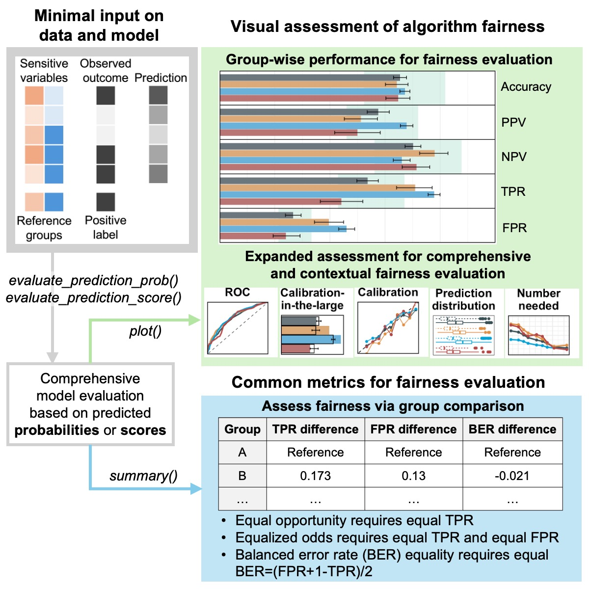

```{r setup, include=FALSE}
knitr::opts_chunk$set(echo = TRUE, collapse = TRUE, cache = FALSE,
                      fig.height = 4)
```

## seeBias Introduction

There is increasing emphasis on fairness in artificial intelligence (AI) prediction models to enable their responsible adoption in high-stakes domains such as healthcare and criminal justice. Guidelines and implementation frameworks highlight the importance of both predictive accuracy and equitable outcomes. However, current fairness toolkits often evaluate classification performance disparities in isolation, with limited attention to other critical aspects such as calibration. To address these gaps, we present seeBias, an R package that provides comprehensive evaluation of model fairness and predictive performance, offering a more complete view of model behavior across classification, calibration, and beyond. 

As visually summarized in the figure below, the seeBias package has three main components: 

- specifying the necessary data to compute relevant metrics, 
- generating a summary table for conventional fairness evaluation, and 
- creating detailed visualizations for comprehensive evaluation of model performance and fairness. 

<div class="figure" style="text-align: center">

</div>

## Installation

**Currently seeBias is implemented as an R package. A Python version is under development.**

Execute the following commands in R to install the R package from GitHub:

```{r, eval=FALSE}
if (!require("devtools", quietly = TRUE)) install.packages("devtools")
devtools::install_github("nliulab/seeBias")
```

## Usage

The R code below is a simplified version of Case Study 1 from the paper
*seeBias: A Comprehensive Tool for Assessing and Visualizing Fairness in AI
Prediction Models* to demonstrate how to use the functions in seeBias.

For more details on both case studies and on formatting figures generated by
seeBias, see the guide books provided below:

- [Case Study 1: Intersectional Bias in Recidivism Prediction](CaseStudy1_COMPAS.md)
- [Case Study 2: Clinical Fairness Evaluation in ROSC Prediction](CaseStudy2_ROC.md)

In the demo below, we use logistic regression to predict two-year recidivism
based on the COMPAS dataset, focusing on White and Black individuals. We then
use seeBias to evaluate the fairness of the prediction model.

```{r}
library(dplyr)
library(seeBias)
data("compas")
dat <- compas %>% filter(Ethnicity %in% c("Caucasian", "African_American"))
dat$Ethnicity <- ifelse(dat$Ethnicity == "African_American", "Black", "White")
m <- dat %>% select(-Ethnicity, -Sex) %>% 
  glm(Two_yr_Recidivism ~ ., data = ., family = "binomial")
```

Evaluate intersectional bias across race and gender:

```{r}
# Extracted predicted risk and observations from test data.
# If not specified, the best threshold in ROC analysis is used.
x <- dat %>% select(Ethnicity, Sex) %>% evaluate_prediction_prob(
  y_pred = predict(m, newdata = dat, type = "response"), 
  y_obs = dat$Two_yr_Recidivism, y_pos = "1",
  sens_var = ., sens_var_ref = c("White", "Male")
)
```

Table of fairness metrics:

```{r results='asis'}
summary(x)
```

Figures for more in-depth fairness evaluation:

```{r, fig.width = 10, fig.height = 6}
x_plots <- plot(x)
```

```{r, fig.width=7.5}
x_plots$`ROC curves`
```

```{r, fig.width=6}
x_plots$`Calibration in the large`
```

```{r, fig.width=6.5}
x_plots$`Calibration curves`
```

```{r, fig.width=6}
x_plots$`Boxplot of predictions`
```

```{r, fig.width=6.5}
x_plots$`Number needed for true positive`
```

```{r, fig.width=6.5}
x_plots$`Number needed for true negative`
```

## Contact

- Yilin Ning (Email: yilin.ning@duke-nus.edu.sg)
- Nan Liu (Email: liu.nan@duke-nus.edu.sg)
