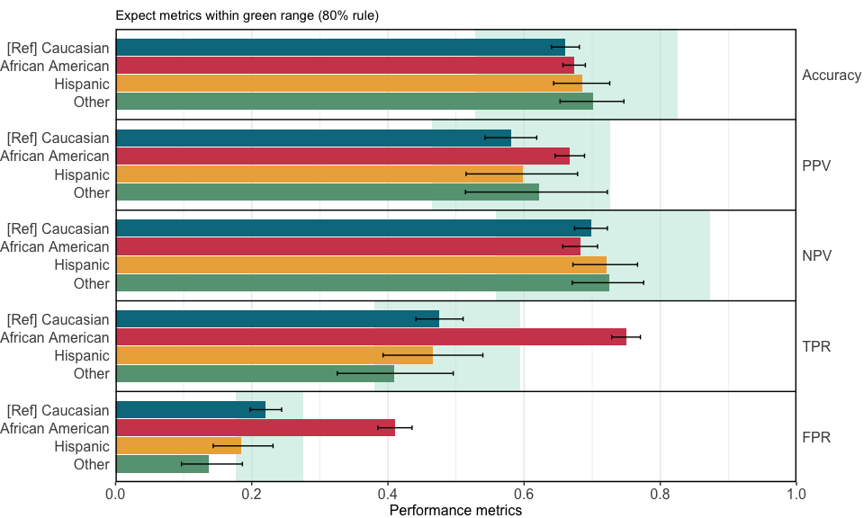
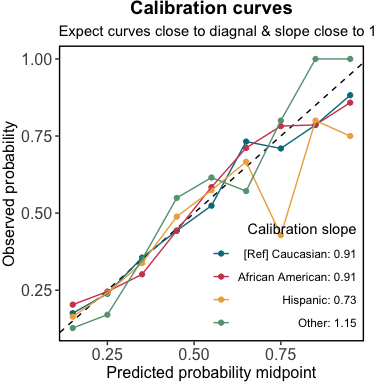
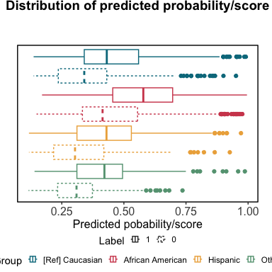

seeBias: Fairness Evaluation and Visualisation
================

- [Demo](#demo)
  - [Usage](#usage)
  - [Details on return values](#details-on-return-values)
  - [Multiple sensitive variables](#multiple-sensitive-variables)
  - [Specify predicted scores](#specify-predicted-scores)

## Demo

### Usage

``` r
library(seeBias)
# Load example data
data("compas")
head(compas)
##   Two_yr_Recidivism Number_of_Priors Age_Above_FourtyFive Age_Below_TwentyFive
## 1                 0                0                    1                    0
## 2                 1                0                    0                    0
## 3                 1                4                    0                    1
## 4                 0                0                    0                    0
## 5                 1               14                    0                    0
## 6                 0                3                    0                    0
##   Misdemeanor        Ethnicity  Sex
## 1           0            Other Male
## 2           0 African_American Male
## 3           0 African_American Male
## 4           1            Other Male
## 5           0        Caucasian Male
## 6           0            Other Male
table(compas$Two_yr_Recidivism, compas$Ethnicity)
##    
##     African_American Asian Caucasian Hispanic Native_American Other
##   0             1514    23      1281      320               6   219
##   1             1661     8       822      189               5   124
# Not sensible to analyse Asian and Native American as separate categories due
# to insufficient observations. Combine into Other.
compas$Ethnicity <- ifelse(compas$Ethnicity %in% c("Asian", "Native_American"),
                           "Other", as.character(compas$Ethnicity))
compas$Ethnicity <- ifelse(compas$Ethnicity == "African_American",
                           "African American", as.character(compas$Ethnicity))
table(compas$Two_yr_Recidivism, compas$Ethnicity)
##    
##     African American Caucasian Hispanic Other
##   0             1514      1281      320   248
##   1             1661       822      189   137
m <- glm(Two_yr_Recidivism ~ ., data = compas, family = "binomial")
# Extracted predicted risk and observations from test data.
# If not specified, the best threshold in ROC analysis is used.
x <- evaluate_prediction_prob(
  y_pred = predict(m, newdata = compas, type = "response"), 
  y_obs = compas$Two_yr_Recidivism, y_pos = "1",
  sens_var = compas$Ethnicity, sens_var_ref = "Caucasian"
)
## Threshold=0.455 set by ROC analysis.
## Configuring sensitive variables ...
##     4 subgroups based on sensitive variables ('sens_var'): African American, Caucasian, Hispanic, Other.
##     Reference group: Caucasian.
## Configuration completed.
x_plots <- plot(x)
```

<!-- -->

### Details on return values

`seeBias` object:

``` r
x$fairness_evaluation$df_prob
##              group     p_obs p_obs_lower p_obs_upper    p_pred     ratio
## 1  [Ref] Caucasian 0.3908702   0.3699987   0.4117417 0.3200190 1.0000000
## 2 African American 0.5231496   0.5057670   0.5405322 0.5880315 1.8374892
## 3         Hispanic 0.3713163   0.3292010   0.4134316 0.2888016 0.9024513
## 4            Other 0.3558442   0.3078068   0.4038815 0.2337662 0.7304761
x$fairness_evaluation$df_metrics
##               group   metric       est     lower     upper     ratio
## 1   [Ref] Caucasian Accuracy 0.6609605 0.6402771 0.6811944 1.0000000
## 2   [Ref] Caucasian      PPV 0.5809807 0.5426735 0.6185746 1.0000000
## 3   [Ref] Caucasian      NPV 0.6986014 0.6740783 0.7223058 1.0000000
## 4   [Ref] Caucasian      TPR 0.4756691 0.4410603 0.5104529 1.0000000
## 5   [Ref] Caucasian      FPR 0.2201405 0.1977233 0.2438495 1.0000000
## 6  African American Accuracy 0.6737008 0.6570803 0.6900007 1.0192754
## 7  African American      PPV 0.6673808 0.6454912 0.6887433 1.1487143
## 8  African American      NPV 0.6827217 0.6567274 0.7078922 0.9772693
## 9  African American      TPR 0.7501505 0.7285989 0.7708146 1.5770428
## 10 African American      FPR 0.4101717 0.3852601 0.4354325 1.8632269
## 11         Hispanic Accuracy 0.6856582 0.6433513 0.7257926 1.0373663
## 12         Hispanic      PPV 0.5986395 0.5146707 0.6785490 1.0303948
## 13         Hispanic      NPV 0.7209945 0.6717274 0.7666047 1.0320542
## 14         Hispanic      TPR 0.4656085 0.3928890 0.5394236 0.9788495
## 15         Hispanic      FPR 0.1843750 0.1434193 0.2312853 0.8375332
## 16            Other Accuracy 0.7012987 0.6528568 0.7466136 1.0610296
## 17            Other      PPV 0.6222222 0.5138260 0.7223355 1.0709861
## 18            Other      NPV 0.7254237 0.6707004 0.7755549 1.0383943
## 19            Other      TPR 0.4087591 0.3255922 0.4959586 0.8593350
## 20            Other      FPR 0.1370968 0.0968474 0.1862773 0.6227694
x$fairness_evaluation$df_auc
##         auc     lower     upper            group
## 1 0.7345038 0.6829754 0.7860321            Other
## 2 0.7235610 0.7059863 0.7411358 African American
## 3 0.6879125 0.6648976 0.7109275  [Ref] Caucasian
## 4 0.6941220 0.6466635 0.7415805         Hispanic
x$fairness_evaluation$df_calib
## # A tibble: 36 × 7
##    predicted_midpoint event_rate events total lower upper group           
##                 <dbl>      <dbl>  <dbl> <int> <dbl> <dbl> <fct>           
##  1               0.15      0.175     37   211 0.134 0.225 [Ref] Caucasian 
##  2               0.25      0.239     99   415 0.205 0.276 [Ref] Caucasian 
##  3               0.35      0.356    232   652 0.325 0.388 [Ref] Caucasian 
##  4               0.45      0.443    128   289 0.394 0.493 [Ref] Caucasian 
##  5               0.55      0.524    174   332 0.477 0.570 [Ref] Caucasian 
##  6               0.65      0.732     71    97 0.647 0.803 [Ref] Caucasian 
##  7               0.75      0.710     44    62 0.599 0.801 [Ref] Caucasian 
##  8               0.85      0.786     22    28 0.617 0.898 [Ref] Caucasian 
##  9               0.95      0.882     15    17 0.665 0.975 [Ref] Caucasian 
## 10               0.15      0.203     13    64 0.127 0.306 African American
## # ℹ 26 more rows
head(x$fairness_evaluation$df_roc)
##         fpr       tpr group
## 1 0.9919355 1.0000000 Other
## 2 0.9677419 0.9927007 Other
## 3 0.8790323 0.9854015 Other
## 4 0.8669355 0.9781022 Other
## 5 0.8064516 0.9489051 Other
## 6 0.7782258 0.9343066 Other
```

Individual plots:

``` r
x_plots$metrics
```

<!-- -->

``` r
x_plots$roc
```

<!-- -->

``` r
x_plots$calibration_in_large
```

<!-- -->

``` r
x_plots$calibration
```

<!-- -->

``` r
x_plots$score
```

<!-- -->

### Multiple sensitive variables

``` r
x2 <- evaluate_prediction_prob(
  y_pred = predict(m, newdata = compas, type = "response"), 
  y_obs = compas$Two_yr_Recidivism, y_pos = "1",
  sens_var = cbind(as.character(compas$Ethnicity), as.character(compas$Sex)), 
  sens_var_ref = c("Caucasian", "Male")
)
## Threshold=0.455 set by ROC analysis.
## Configuring sensitive variables ...
##     8 subgroups based on sensitive variables ('sens_var'): African American & Female, Caucasian & Female, Hispanic & Female, Other & Female, African American & Male, Caucasian & Male, Hispanic & Male, Other & Male.
##     Reference group: Caucasian & Male.
## Configuration completed.
## Warning in qf(p = alpha/2, df1 = 2 * x, df2 = 2 * (n - x + 1)): NaNs produced
## Warning in qf(p = 1 - alpha/2, df1 = 2 * (x + 1), df2 = 2 * (n - x)): NaNs
## produced
x_plots2 <- plot(x2, print_statistics = FALSE)
```

<!-- -->

``` r
x_plots2$roc
```

<!-- -->

``` r
x_plots2$calibration_in_large
```

<!-- -->

``` r
x_plots2$calibration
```

<!-- -->

``` r
x_plots2$score
```

<!-- -->

### Specify predicted scores

``` r
x3 <- evaluate_prediction_score(
  y_pred = predict(m, newdata = compas), 
  y_obs = compas$Two_yr_Recidivism, y_pos = "1",
  sens_var = cbind(as.character(compas$Ethnicity), as.character(compas$Sex)), 
  sens_var_ref = c("Caucasian", "Male")
)
## Threshold=-0.181 set by ROC analysis.
## Configuring sensitive variables ...
##     8 subgroups based on sensitive variables ('sens_var'): African American & Female, Caucasian & Female, Hispanic & Female, Other & Female, African American & Male, Caucasian & Male, Hispanic & Male, Other & Male.
##     Reference group: Caucasian & Male.
## Configuration completed.
## Warning in qf(p = alpha/2, df1 = 2 * x, df2 = 2 * (n - x + 1)): NaNs produced
## Warning in qf(p = 1 - alpha/2, df1 = 2 * (x + 1), df2 = 2 * (n - x)): NaNs
## produced
x_plots3 <- plot(x3, print_statistics = FALSE)
```

<!-- -->

``` r
x_plots3$roc
```

<!-- -->

``` r
x_plots3$calibration_in_large
```

<!-- -->

``` r
x_plots3$calibration
```

<!-- -->

``` r
x_plots3$score
```

<!-- -->
