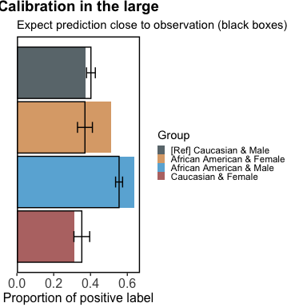
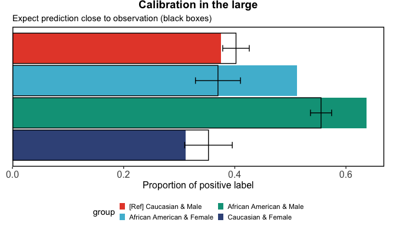
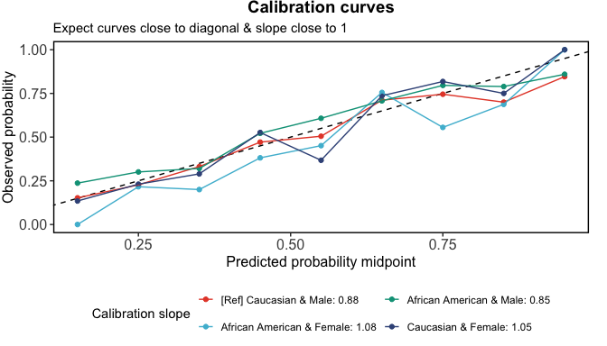
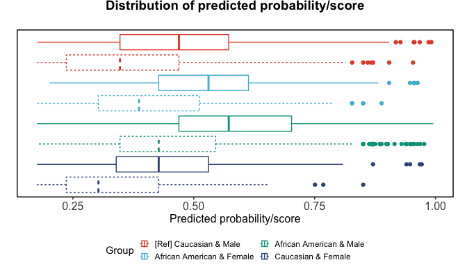
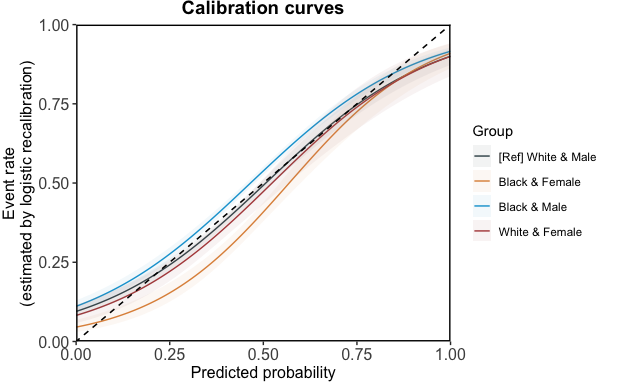
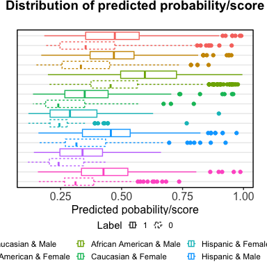
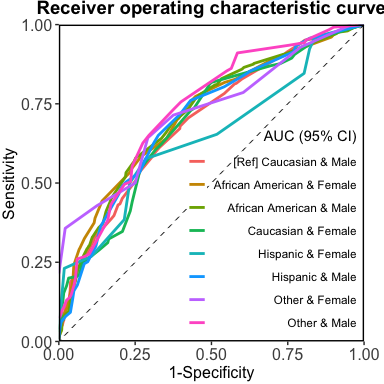
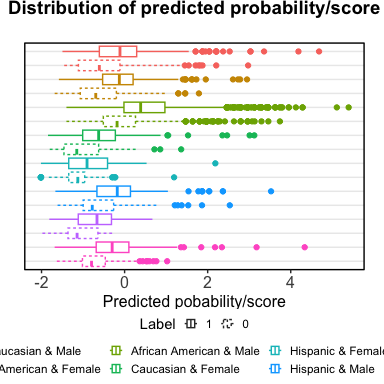

seeBias: Fairness Evaluation and Visualisation
================

- [Demo](#demo)
  - [Usage](#usage)
  - [Details on return values](#details-on-return-values)
  - [Multiple sensitive variables](#multiple-sensitive-variables)
  - [Specify predicted scores](#specify-predicted-scores)

## Demo

### Usage

``` r
library(seeBias)
# Load example data
data("compas")
head(compas)
##   Two_yr_Recidivism Number_of_Priors Age_Above_FourtyFive Age_Below_TwentyFive
## 1                 0                0                    1                    0
## 2                 1                0                    0                    0
## 3                 1                4                    0                    1
## 4                 0                0                    0                    0
## 5                 1               14                    0                    0
## 6                 0                3                    0                    0
##   Misdemeanor        Ethnicity  Sex
## 1           0            Other Male
## 2           0 African_American Male
## 3           0 African_American Male
## 4           1            Other Male
## 5           0        Caucasian Male
## 6           0            Other Male
table(compas$Two_yr_Recidivism, compas$Ethnicity)
##    
##     African_American Asian Caucasian Hispanic Native_American Other
##   0             1514    23      1281      320               6   219
##   1             1661     8       822      189               5   124
# Not sensible to analyse Asian and Native American as separate categories due
# to insufficient observations. Combine into Other.
compas$Ethnicity <- ifelse(compas$Ethnicity %in% c("Asian", "Native_American"),
                           "Other", as.character(compas$Ethnicity))
compas$Ethnicity <- ifelse(compas$Ethnicity == "African_American",
                           "African American", as.character(compas$Ethnicity))
table(compas$Two_yr_Recidivism, compas$Ethnicity)
##    
##     African American Caucasian Hispanic Other
##   0             1514      1281      320   248
##   1             1661       822      189   137
m <- glm(Two_yr_Recidivism ~ ., data = compas, family = "binomial")
# Extracted predicted risk and observations from test data.
# If not specified, the best threshold in ROC analysis is used.
x <- evaluate_prediction_prob(
  y_pred = predict(m, newdata = compas, type = "response"), 
  y_obs = compas$Two_yr_Recidivism, y_pos = "1",
  sens_var = compas$Ethnicity, sens_var_ref = "Caucasian"
)
## Threshold=0.455 set by ROC analysis.
## Configuring sensitive variables ...
##     4 subgroups based on sensitive variables ('sens_var'): African American, Caucasian, Hispanic, Other.
##     Reference group: Caucasian.
## Configuration completed.
x_plots <- plot(x)
```

<!-- -->

``` r
summary(x)
```

| Subgroup         | Equal opportunity difference | Equalised odds difference | BER equality difference |
|:-----------------|-----------------------------:|--------------------------:|------------------------:|
| African American |                        0.274 |                     0.274 |                  -0.042 |
| Hispanic         |                       -0.010 |                    -0.036 |                  -0.013 |
| Other            |                       -0.067 |                    -0.083 |                  -0.008 |

Equal opportunity ensures that different subgroups have the same True
Positive Rate (TPR). This means that the model is equally good at
correctly identifying positive cases across all groups. It is measured
by comparing the TPR of each subgroup to that of a reference group,
either through a ratio or a difference.

Equalised odds ensures that different subgroups have the same True
Positive Rate (TPR) and False Positive Rate (FPR). This means the model
is equally accurate and equally prone to errors across all groups. It is
assessed by separately comparing the TPR and FPR of each subgroup to
those of a reference group, and then taking the larger disparity—whether
it’s in the TPR or FPR—based on the ratio or difference.

Balanced error rate (BER) equality ensures that the Balanced Error Rate
(BER) is consistent across different subgroups. BER is calculated as the
average of the False Positive Rate (FPR) and False Negative Rate (FNR,
which is 1 minus the True Positive Rate \[TPR\]). This means the model’s
overall error rate, considering both false positives and false
negatives, is uniform across all groups. It is assessed by comparing the
BER of each subgroup to that of a reference group, with disparities
measured using either ratios or differences.

### Details on return values

`seeBias` object:

``` r
x$performance_evaluation$df_prob
##              group     p_obs p_obs_lower p_obs_upper    p_pred     ratio
## 1  [Ref] Caucasian 0.3908702   0.3699987   0.4117417 0.3200190 1.0000000
## 2 African American 0.5231496   0.5057670   0.5405322 0.5880315 1.8374892
## 3         Hispanic 0.3713163   0.3292010   0.4134316 0.2888016 0.9024513
## 4            Other 0.3558442   0.3078068   0.4038815 0.2337662 0.7304761
x$performance_evaluation$df_metrics
##               group   metric       est     lower     upper     ratio
## 1   [Ref] Caucasian Accuracy 0.6609605 0.6402771 0.6811944 1.0000000
## 2   [Ref] Caucasian      PPV 0.5809807 0.5426735 0.6185746 1.0000000
## 3   [Ref] Caucasian      NPV 0.6986014 0.6740783 0.7223058 1.0000000
## 4   [Ref] Caucasian      TPR 0.4756691 0.4410603 0.5104529 1.0000000
## 5   [Ref] Caucasian      FPR 0.2201405 0.1977233 0.2438495 1.0000000
## 6  African American Accuracy 0.6737008 0.6570803 0.6900007 1.0192754
## 7  African American      PPV 0.6673808 0.6454912 0.6887433 1.1487143
## 8  African American      NPV 0.6827217 0.6567274 0.7078922 0.9772693
## 9  African American      TPR 0.7501505 0.7285989 0.7708146 1.5770428
## 10 African American      FPR 0.4101717 0.3852601 0.4354325 1.8632269
## 11         Hispanic Accuracy 0.6856582 0.6433513 0.7257926 1.0373663
## 12         Hispanic      PPV 0.5986395 0.5146707 0.6785490 1.0303948
## 13         Hispanic      NPV 0.7209945 0.6717274 0.7666047 1.0320542
## 14         Hispanic      TPR 0.4656085 0.3928890 0.5394236 0.9788495
## 15         Hispanic      FPR 0.1843750 0.1434193 0.2312853 0.8375332
## 16            Other Accuracy 0.7012987 0.6528568 0.7466136 1.0610296
## 17            Other      PPV 0.6222222 0.5138260 0.7223355 1.0709861
## 18            Other      NPV 0.7254237 0.6707004 0.7755549 1.0383943
## 19            Other      TPR 0.4087591 0.3255922 0.4959586 0.8593350
## 20            Other      FPR 0.1370968 0.0968474 0.1862773 0.6227694
x$performance_evaluation$df_auc
##         auc     lower     upper            group
## 1 0.7345038 0.6829754 0.7860321            Other
## 2 0.7235610 0.7059863 0.7411358 African American
## 3 0.6879125 0.6648976 0.7109275  [Ref] Caucasian
## 4 0.6941220 0.6466635 0.7415805         Hispanic
x$performance_evaluation$df_calib
## # A tibble: 36 × 7
##    predicted_midpoint event_rate events total lower upper group           
##                 <dbl>      <dbl>  <dbl> <int> <dbl> <dbl> <fct>           
##  1               0.15      0.175     37   211 0.134 0.225 [Ref] Caucasian 
##  2               0.25      0.239     99   415 0.205 0.276 [Ref] Caucasian 
##  3               0.35      0.356    232   652 0.325 0.388 [Ref] Caucasian 
##  4               0.45      0.443    128   289 0.394 0.493 [Ref] Caucasian 
##  5               0.55      0.524    174   332 0.477 0.570 [Ref] Caucasian 
##  6               0.65      0.732     71    97 0.647 0.803 [Ref] Caucasian 
##  7               0.75      0.710     44    62 0.599 0.801 [Ref] Caucasian 
##  8               0.85      0.786     22    28 0.617 0.898 [Ref] Caucasian 
##  9               0.95      0.882     15    17 0.665 0.975 [Ref] Caucasian 
## 10               0.15      0.203     13    64 0.127 0.306 African American
## # ℹ 26 more rows
head(x$fairness_evaluation$df_roc)
## NULL
```

Individual plots:

``` r
x_plots$metrics
```

<!-- -->

``` r
x_plots$roc
```

<!-- -->

``` r
x_plots$calibration_in_large
```

<!-- -->

``` r
x_plots$calibration
```

<!-- -->

``` r
x_plots$score
```

<!-- -->

User define color scheme:

``` r
x_plots$metrics + ggsci::scale_fill_npg()
## Scale for fill is already present.
## Adding another scale for fill, which will replace the existing scale.
```

<!-- -->

``` r
x_plots$roc + ggsci::scale_color_npg()
## Scale for colour is already present.
## Adding another scale for colour, which will replace the existing scale.
```

<!-- -->

``` r
x_plots$calibration_in_large + ggsci::scale_fill_npg()
## Scale for fill is already present.
## Adding another scale for fill, which will replace the existing scale.
```

<!-- -->

``` r
x_plots$calibration + ggsci::scale_color_npg()
## Scale for colour is already present.
## Adding another scale for colour, which will replace the existing scale.
```

<!-- -->

``` r
x_plots$score + ggsci::scale_color_npg()
## Scale for colour is already present.
## Adding another scale for colour, which will replace the existing scale.
```

<!-- -->

### Multiple sensitive variables

``` r
x2 <- evaluate_prediction_prob(
  y_pred = predict(m, newdata = compas, type = "response"), 
  y_obs = compas$Two_yr_Recidivism, y_pos = "1",
  sens_var = cbind(as.character(compas$Ethnicity), as.character(compas$Sex)), 
  sens_var_ref = c("Caucasian", "Male")
)
## Threshold=0.455 set by ROC analysis.
## Configuring sensitive variables ...
##     8 subgroups based on sensitive variables ('sens_var'): African American & Female, Caucasian & Female, Hispanic & Female, Other & Female, African American & Male, Caucasian & Male, Hispanic & Male, Other & Male.
##     Reference group: Caucasian & Male.
## Configuration completed.
## Warning in qf(p = alpha/2, df1 = 2 * x, df2 = 2 * (n - x + 1)): NaNs produced
## Warning in qf(p = 1 - alpha/2, df1 = 2 * (x + 1), df2 = 2 * (n - x)): NaNs
## produced
x_plots2 <- plot(x2, print_statistics = FALSE)
```

<!-- -->

``` r
summary(x2)
```

| Subgroup                  | Equal opportunity difference | Equalised odds difference | BER equality difference |
|:--------------------------|-----------------------------:|--------------------------:|------------------------:|
| African American & Female |                        0.010 |                    -0.026 |                  -0.018 |
| African American & Male   |                        0.242 |                     0.242 |                  -0.024 |
| Caucasian & Female        |                       -0.296 |                    -0.296 |                   0.053 |
| Hispanic & Female         |                       -0.306 |                    -0.306 |                   0.029 |
| Hispanic & Male           |                       -0.034 |                    -0.047 |                  -0.006 |
| Other & Female            |                       -0.323 |                    -0.323 |                   0.028 |
| Other & Male              |                       -0.106 |                    -0.106 |                   0.005 |

Equal opportunity ensures that different subgroups have the same True
Positive Rate (TPR). This means that the model is equally good at
correctly identifying positive cases across all groups. It is measured
by comparing the TPR of each subgroup to that of a reference group,
either through a ratio or a difference.

Equalised odds ensures that different subgroups have the same True
Positive Rate (TPR) and False Positive Rate (FPR). This means the model
is equally accurate and equally prone to errors across all groups. It is
assessed by separately comparing the TPR and FPR of each subgroup to
those of a reference group, and then taking the larger disparity—whether
it’s in the TPR or FPR—based on the ratio or difference.

Balanced error rate (BER) equality ensures that the Balanced Error Rate
(BER) is consistent across different subgroups. BER is calculated as the
average of the False Positive Rate (FPR) and False Negative Rate (FNR,
which is 1 minus the True Positive Rate \[TPR\]). This means the model’s
overall error rate, considering both false positives and false
negatives, is uniform across all groups. It is assessed by comparing the
BER of each subgroup to that of a reference group, with disparities
measured using either ratios or differences.

``` r
x_plots2$roc
```

<!-- -->

``` r
x_plots2$calibration_in_large
```

<!-- -->

``` r
x_plots2$calibration
```

<!-- -->

``` r
x_plots2$score
```

<!-- -->

### Specify predicted scores

``` r
x3 <- evaluate_prediction_score(
  y_pred = predict(m, newdata = compas), 
  y_obs = compas$Two_yr_Recidivism, y_pos = "1",
  sens_var = cbind(as.character(compas$Ethnicity), as.character(compas$Sex)), 
  sens_var_ref = c("Caucasian", "Male")
)
## Threshold=-0.181 set by ROC analysis.
## Configuring sensitive variables ...
##     8 subgroups based on sensitive variables ('sens_var'): African American & Female, Caucasian & Female, Hispanic & Female, Other & Female, African American & Male, Caucasian & Male, Hispanic & Male, Other & Male.
##     Reference group: Caucasian & Male.
## Configuration completed.
## Warning in qf(p = alpha/2, df1 = 2 * x, df2 = 2 * (n - x + 1)): NaNs produced
## Warning in qf(p = 1 - alpha/2, df1 = 2 * (x + 1), df2 = 2 * (n - x)): NaNs
## produced
x_plots3 <- plot(x3, print_statistics = FALSE)
```

<!-- -->

``` r
summary(x3)
```

| Subgroup                  | Equal opportunity difference | Equalised odds difference | BER equality difference |
|:--------------------------|-----------------------------:|--------------------------:|------------------------:|
| African American & Female |                        0.010 |                    -0.026 |                  -0.018 |
| African American & Male   |                        0.242 |                     0.242 |                  -0.024 |
| Caucasian & Female        |                       -0.296 |                    -0.296 |                   0.053 |
| Hispanic & Female         |                       -0.306 |                    -0.306 |                   0.029 |
| Hispanic & Male           |                       -0.034 |                    -0.047 |                  -0.006 |
| Other & Female            |                       -0.323 |                    -0.323 |                   0.028 |
| Other & Male              |                       -0.106 |                    -0.106 |                   0.005 |

Equal opportunity ensures that different subgroups have the same True
Positive Rate (TPR). This means that the model is equally good at
correctly identifying positive cases across all groups. It is measured
by comparing the TPR of each subgroup to that of a reference group,
either through a ratio or a difference.

Equalised odds ensures that different subgroups have the same True
Positive Rate (TPR) and False Positive Rate (FPR). This means the model
is equally accurate and equally prone to errors across all groups. It is
assessed by separately comparing the TPR and FPR of each subgroup to
those of a reference group, and then taking the larger disparity—whether
it’s in the TPR or FPR—based on the ratio or difference.

Balanced error rate (BER) equality ensures that the Balanced Error Rate
(BER) is consistent across different subgroups. BER is calculated as the
average of the False Positive Rate (FPR) and False Negative Rate (FNR,
which is 1 minus the True Positive Rate \[TPR\]). This means the model’s
overall error rate, considering both false positives and false
negatives, is uniform across all groups. It is assessed by comparing the
BER of each subgroup to that of a reference group, with disparities
measured using either ratios or differences.

``` r
x_plots3$roc
```

<!-- -->

``` r
x_plots3$calibration_in_large
```

<!-- -->

``` r
x_plots3$calibration
```

<!-- -->

``` r
x_plots3$score
```

<!-- -->
