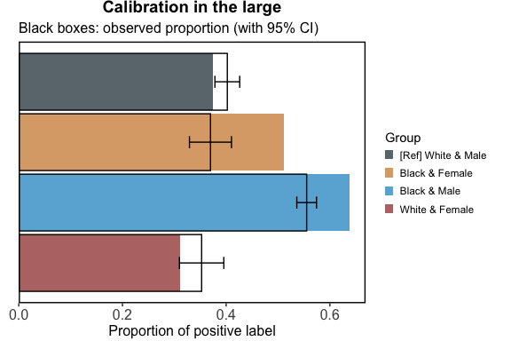

seeBias: Fairness Evaluation and Visualisation
================

- [Demo](#demo)
  - [Fairness metrics](#fairness-metrics)
  - [Visualisation of fairness
    metrics](#visualisation-of-fairness-metrics)

## Demo

Use subset of COMPAS data for Caucasian and African American. Exclude
race and sex from the prediction model.

``` r
library(dplyr)
## 
## Attaching package: 'dplyr'
## The following objects are masked from 'package:stats':
## 
##     filter, lag
## The following objects are masked from 'package:base':
## 
##     intersect, setdiff, setequal, union
library(seeBias)
# Load example data
data("compas")
head(compas)
##   Two_yr_Recidivism Number_of_Priors Age_Above_FourtyFive Age_Below_TwentyFive
## 1                 0                0                    1                    0
## 2                 1                0                    0                    0
## 3                 1                4                    0                    1
## 4                 0                0                    0                    0
## 5                 1               14                    0                    0
## 6                 0                3                    0                    0
##   Misdemeanor        Ethnicity  Sex
## 1           0            Other Male
## 2           0 African_American Male
## 3           0 African_American Male
## 4           1            Other Male
## 5           0        Caucasian Male
## 6           0            Other Male
table(compas$Two_yr_Recidivism, compas$Ethnicity)
##    
##     African_American Asian Caucasian Hispanic Native_American Other
##   0             1514    23      1281      320               6   219
##   1             1661     8       822      189               5   124
compas <- compas %>% filter(Ethnicity %in% c("Caucasian", "African_American"))
compas$Ethnicity <- ifelse(compas$Ethnicity == "African_American",
                           "African American", as.character(compas$Ethnicity))
m <- compas %>% select(-Ethnicity, -Sex) %>% 
  glm(Two_yr_Recidivism ~ ., data = ., family = "binomial")
knitr::kable(summary(m)$coef, digits = 3)
```

|                       | Estimate | Std. Error | z value | Pr(\>\|z\|) |
|:----------------------|---------:|-----------:|--------:|------------:|
| (Intercept)           |   -0.631 |      0.054 | -11.692 |       0.000 |
| Number_of_Priors      |    0.169 |      0.008 |  20.406 |       0.000 |
| Age_Above_FourtyFive1 |   -0.711 |      0.081 |  -8.774 |       0.000 |
| Age_Below_TwentyFive1 |    0.753 |      0.074 |  10.175 |       0.000 |
| Misdemeanor1          |   -0.204 |      0.063 |  -3.219 |       0.001 |

### Fairness metrics

Use race and gender as sensitive variables.

``` r
# Extracted predicted risk and observations from test data.
# If not specified, the best threshold in ROC analysis is used.
x <- compas %>% select(Ethnicity, Sex) %>% evaluate_prediction_prob(
  y_pred = predict(m, newdata = compas, type = "response"), 
  y_obs = compas$Two_yr_Recidivism, y_pos = "1",
  sens_var = ., sens_var_ref = c("Caucasian", "Male")
)
## Threshold=0.440 set by ROC analysis.
## Configuring sensitive variables ...
##     4 subgroups based on sensitive variables ('sens_var'): African American & Female, Caucasian & Female, African American & Male, Caucasian & Male.
##     Reference group: Caucasian & Male.
## Configuration completed.
```

Quantify fairness:

``` r
summary(x)
```

| Group                     | Sample size | TPR difference | FPR difference | TNR difference | BER difference |
|:--------------------------|------------:|:---------------|:---------------|:---------------|:---------------|
| Caucasian & Male          |        1621 | Reference      | Reference      | Reference      | Reference      |
| African American & Female |         549 | 0.173          | 0.13           | -0.13          | -0.021         |
| African American & Male   |        2626 | 0.242          | 0.194          | -0.194         | -0.024         |
| Caucasian & Female        |         482 | -0.096         | -0.026         | 0.026          | 0.035          |

Equal opportunity ensures that different groups have the same true
positive rate (TPR), meaning the model correctly identifies positive
cases equally well across all groups. This can be assessed by comparing
the difference in TPR from the reference group across groups.
Differences close to 0 indicate minimal bias.

Equalised odds ensure that different groups have the same true positive
rate (TPR) and false positive rate (FPR), meaning the model is equally
accurate and equally prone to errors across all groups. This can be
assessed by comparing the differences in each group’s TPR and FPR from
those of a reference group across groups. Differences close to 0
indicate minimal bias.

Balanced error rate (BER) equality ensures that the BER is consistent
across different groups. BER is the average of the false positive rate
(FPR) and the false negative rate (FNR, which is 1 minus the true
positive rate \[TPR\]). This means the model’s overall error rate,
considering both false positives and false negatives, is uniform across
all groups. This can be assessed by comparing the difference in each
group’s BER from that of the reference group across groups. Differences
close to 0 indicate minimal bias.

### Visualisation of fairness metrics

``` r
x_plots <- plot(x)
```

<!-- -->

``` r
x_plots$`ROC curves`
```

<!-- -->

``` r
x_plots$`Calibration in the large`
```

<!-- -->

``` r
x_plots$`Calibration curves`
```

<!-- -->

``` r
x_plots$`Boxplot of predictions`
```

<!-- -->

``` r
x_plots$`Number needed for true positive`
```

<!-- -->

``` r
x_plots$`Number needed for true negative`
```

<!-- -->
