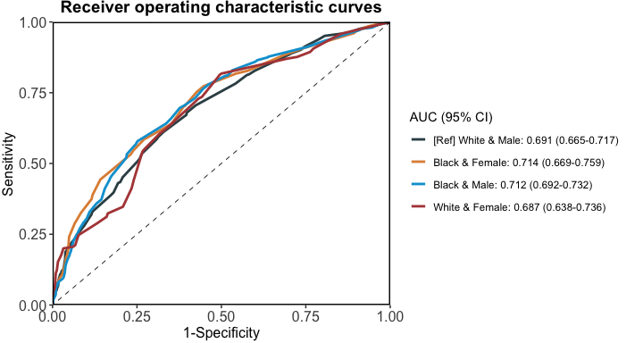
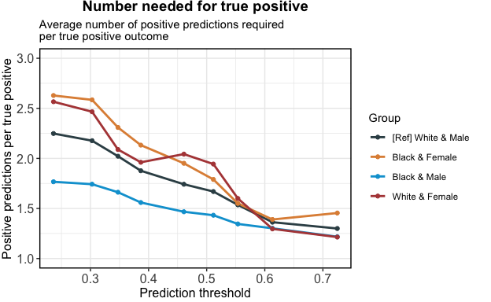

seeBias: A Comprehensive Tool for Assessing and Visualizing AI Fairness
================

- [seeBias Introduction](#seebias-introduction)
- [Installation](#installation)
- [Usage](#usage)
- [Citation](#citation)
- [Contact](#contact)

## seeBias Introduction

There is increasing emphasis on fairness in artificial intelligence (AI)
prediction models to enable their responsible adoption in high-stakes
domains such as healthcare and criminal justice. Guidelines and
implementation frameworks highlight the importance of both predictive
accuracy and equitable outcomes. However, current fairness toolkits
often evaluate classification performance disparities in isolation, with
limited attention to other critical aspects such as calibration. To
address these gaps, we present seeBias, an R package that provides
comprehensive evaluation of model fairness and predictive performance,
offering a more complete view of model behavior across classification,
calibration, and beyond.

As visually summarized in the figure below, the seeBias package has
three main components:

- specifying the necessary data to compute relevant metrics,
- generating a summary table for conventional fairness evaluation, and
- creating detailed visualizations for comprehensive evaluation of model
  performance and fairness.

<div class="figure" style="text-align: center">


</div>

## Installation

**Currently seeBias is implemented as an R package. A Python version is
under development.**

Execute the following commands in R to install the R package from
GitHub:

``` r
if (!require("devtools", quietly = TRUE)) install.packages("devtools")
devtools::install_github("nliulab/seeBias")
```

## Usage

The R code below is a simplified version of Case Study 1 from the paper
*seeBias: A Comprehensive Tool for Assessing and Visualizing Fairness in
AI Prediction Models* to demonstrate how to use the functions in
seeBias.

For more details on both case studies and on formatting figures
generated by seeBias, see the guide books provided below:

- [Case Study 1: Intersectional Bias in Recidivism
  Prediction](CaseStudy1_Recidivism_Prediction.md)
- [Case Study 2: Clinical Fairness Evaluation in ROSC
  Prediction](CaseStudy2_ROSC_Prediction.md)

In the demo below, we use logistic regression to predict two-year
recidivism based on the COMPAS dataset, focusing on White and Black
individuals. We then use seeBias to evaluate the fairness of the
prediction model.

``` r
library(dplyr)
## 
## Attaching package: 'dplyr'
## The following objects are masked from 'package:stats':
## 
##     filter, lag
## The following objects are masked from 'package:base':
## 
##     intersect, setdiff, setequal, union
library(seeBias)
data("compas")
dat <- compas %>% filter(Ethnicity %in% c("Caucasian", "African_American"))
dat$Ethnicity <- ifelse(dat$Ethnicity == "African_American", "Black", "White")
m <- dat %>% select(-Ethnicity, -Sex) %>% 
  glm(Two_yr_Recidivism ~ ., data = ., family = "binomial")
```

Evaluate intersectional bias across race and gender:

``` r
# Extracted predicted risk and observations from test data.
# If not specified, the best threshold in ROC analysis is used.
x <- dat %>% select(Ethnicity, Sex) %>% evaluate_prediction_prob(
  y_pred = predict(m, newdata = dat, type = "response"), 
  y_obs = dat$Two_yr_Recidivism, y_pos = "1",
  sens_var = ., sens_var_ref = c("White", "Male"), 
  # For demonstration, use 200 bootstrap samples to compute CI for performance metrics
  B = 200, conf_level = 0.95
)
## Threshold=0.440 set by ROC analysis.
## Configuring sensitive variables ...
##     4 subgroups based on sensitive variables ('sens_var'): Black & Female, White & Female, Black & Male, White & Male.
##     Reference group: White & Male.
## Configuration completed.
```

Table of fairness metrics:

``` r
summary(x)
```

| Group          | Sample size | TPR difference | FPR difference | TNR difference | BER difference |
|:---------------|------------:|:---------------|:---------------|:---------------|:---------------|
| White & Male   |        1621 | Reference      | Reference      | Reference      | Reference      |
| Black & Female |         549 | 0.173          | 0.13           | -0.13          | -0.021         |
| Black & Male   |        2626 | 0.242          | 0.194          | -0.194         | -0.024         |
| White & Female |         482 | -0.096         | -0.026         | 0.026          | 0.035          |

Equal opportunity ensures that different groups have the same true
positive rate (TPR), meaning the model correctly identifies positive
cases equally well across all groups. This can be assessed by comparing
the difference in TPR from the reference group across groups.
Differences close to 0 indicate minimal bias.

Equalised odds ensures that different groups have the same true positive
rate (TPR) and false positive rate (FPR), meaning the model is equally
accurate and equally prone to errors across all groups. This can be
assessed by comparing the differences in each group’s TPR and FPR from
those of a reference group across groups. Differences close to 0
indicate minimal bias.

Balanced error rate (BER) equality ensures that the BER is consistent
across different groups. BER is the average of the false positive rate
(FPR) and the false negative rate (FNR, which is 1 minus the true
positive rate (TPR)). This means the model’s overall error rate,
considering both false positives and false negatives, is uniform across
all groups. This can be assessed by comparing the difference in each
group’s BER from that of the reference group across groups. Differences
close to 0 indicate minimal bias.

Figures for more in-depth fairness evaluation:

``` r
x_plots <- plot(x)
```

<!-- -->

``` r
x_plots$`ROC curves`
```

<!-- -->

``` r
x_plots$`Calibration in the large`
```

<!-- -->

``` r
x_plots$`Calibration curves`
```

<!-- -->

``` r
x_plots$`Boxplot of predictions`
```

<!-- -->

``` r
x_plots$`Number needed for true positive`
```

<!-- -->

``` r
x_plots$`Number needed for true negative`
```

<!-- -->

## Citation

- Ning Y, Ma Y, Liu M, Li X, Liu N. [seeBias: A Comprehensive Tool for
  Assessing and Visualizing AI
  Fairness](https://doi.org/10.48550/arXiv.2504.08418). *arXiv*
  arXiv:2504.08418.

## Contact

- Yilin Ning (Email: <yilin.ning@duke-nus.edu.sg>)
- Nan Liu (Email: <liu.nan@duke-nus.edu.sg>)
