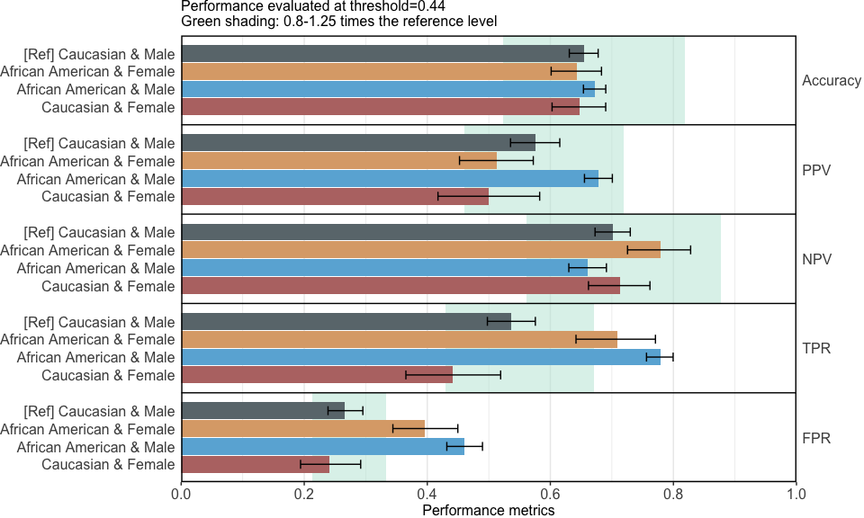
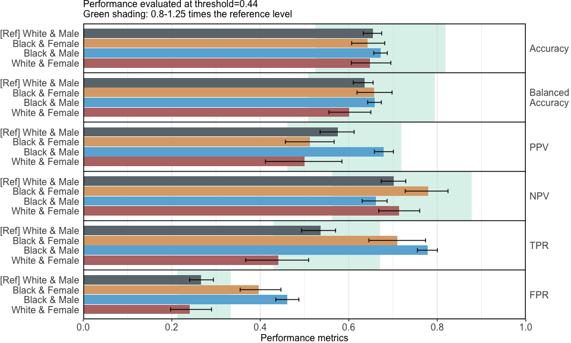
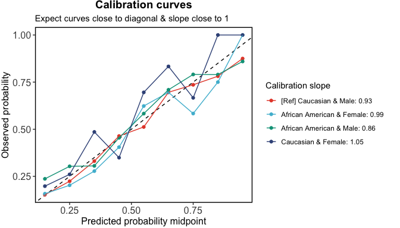
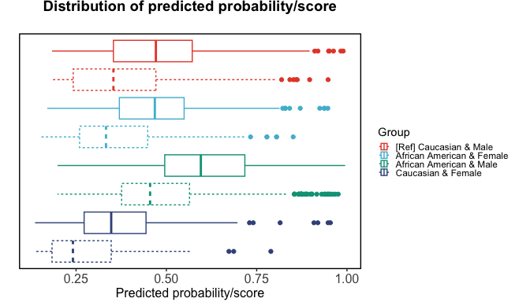
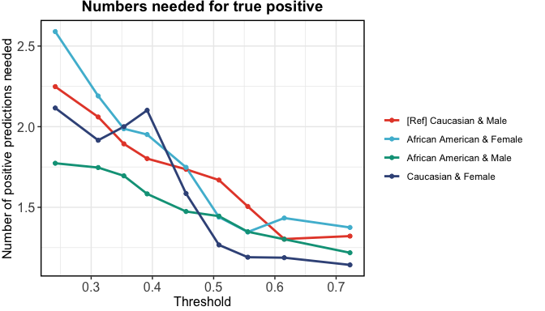
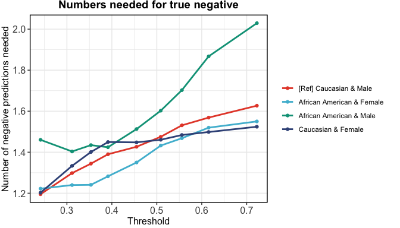

seeBias: Fairness Evaluation and Visualisation
================

- [Demo](#demo)
  - [Fairness metrics](#fairness-metrics)
  - [Visualisation of fairness
    metrics](#visualisation-of-fairness-metrics)

## Demo

Use subset of COMPAS data for Caucasian and African American.

``` r
library(dplyr)
## 
## Attaching package: 'dplyr'
## The following objects are masked from 'package:stats':
## 
##     filter, lag
## The following objects are masked from 'package:base':
## 
##     intersect, setdiff, setequal, union
library(seeBias)
# Load example data
data("compas")
head(compas)
##   Two_yr_Recidivism Number_of_Priors Age_Above_FourtyFive Age_Below_TwentyFive
## 1                 0                0                    1                    0
## 2                 1                0                    0                    0
## 3                 1                4                    0                    1
## 4                 0                0                    0                    0
## 5                 1               14                    0                    0
## 6                 0                3                    0                    0
##   Misdemeanor        Ethnicity  Sex
## 1           0            Other Male
## 2           0 African_American Male
## 3           0 African_American Male
## 4           1            Other Male
## 5           0        Caucasian Male
## 6           0            Other Male
table(compas$Two_yr_Recidivism, compas$Ethnicity)
##    
##     African_American Asian Caucasian Hispanic Native_American Other
##   0             1514    23      1281      320               6   219
##   1             1661     8       822      189               5   124
compas <- compas %>% filter(Ethnicity %in% c("Caucasian", "African_American"))
compas$Ethnicity <- ifelse(compas$Ethnicity == "African_American",
                           "African American", as.character(compas$Ethnicity))
m <- glm(Two_yr_Recidivism ~ ., data = compas, family = "binomial")
```

### Fairness metrics

Use race and gender as sensitive variables.

``` r
# Extracted predicted risk and observations from test data.
# If not specified, the best threshold in ROC analysis is used.
x <- compas %>% select(Ethnicity, Sex) %>% evaluate_prediction_prob(
  y_pred = predict(m, newdata = compas, type = "response"), 
  y_obs = compas$Two_yr_Recidivism, y_pos = "1",
  sens_var = ., sens_var_ref = c("Caucasian", "Male")
)
## Threshold=0.448 set by ROC analysis.
## Configuring sensitive variables ...
##     4 subgroups based on sensitive variables ('sens_var'): African American & Female, Caucasian & Female, African American & Male, Caucasian & Male.
##     Reference group: Caucasian & Male.
## Configuration completed.
```

Quantify fairness (<font color="red">Table heading and metric
definitions to be finalised</font>):

``` r
summary(x)
```

| Group                     | Equal opportunity difference | Equalised odds difference | BER equality difference |
|:--------------------------|-----------------------------:|--------------------------:|------------------------:|
| African American & Female |                         0.01 |                    -0.026 |                  -0.018 |
| African American & Male   |                         0.29 |                     0.290 |                  -0.015 |
| Caucasian & Female        |                        -0.29 |                    -0.290 |                   0.050 |

The reference group is Caucasian & Male

Equal opportunity ensures that different groups have the same true
positive rate (TPR), meaning the model correctly identifies positive
cases equally well across all groups. We assess this by first
calculating the difference in TPR between each group and a reference
group, then comparing these differences across groups. Differences close
to 0 indicate minimal bias.

Equalised odds ensure that different groups have the same true positive
rate (TPR) and false positive rate (FPR), meaning the model is equally
accurate and equally prone to errors across all groups. We assess this
by first calculating the differences in each group’s TPR and FPR
compared to those of a reference group, focusing on the larger
disparity—whether in TPR or FPR—and then comparing these differences
across groups. Differences close to 0 indicate minimal bias.

Balanced error rate (BER) equality ensures that the BER is consistent
across different groups. BER is the average of the false positive rate
(FPR) and the false negative rate (FNR, which is 1 minus the true
positive rate \[TPR\]). This means the model’s overall error rate,
considering both false positives and false negatives, is uniform across
all groups. We assess this by first calculating the difference in each
group’s BER compared to that of a reference group, and then comparing
these differences across groups. Differences close to 0 indicate minimal
bias.

### Visualisation of fairness metrics

``` r
x_plots <- plot(x)
```

<!-- -->

Alternative color scheme:

``` r
x_plots$`Performance metrics` + ggsci::scale_fill_npg()
## Scale for fill is already present.
## Adding another scale for fill, which will replace the existing scale.
```

<!-- -->

``` r
x_plots$`ROC curves` + ggsci::scale_color_npg()
## Scale for colour is already present.
## Adding another scale for colour, which will replace the existing scale.
```

<!-- -->

``` r
x_plots$`Calibration in the large` + ggsci::scale_fill_npg()
## Scale for fill is already present.
## Adding another scale for fill, which will replace the existing scale.
```

<!-- -->

``` r
x_plots$`Calibration curves` + ggsci::scale_color_npg()
## Scale for colour is already present.
## Adding another scale for colour, which will replace the existing scale.
```

<!-- -->

``` r
x_plots$`Boxplot of predictions` + ggsci::scale_color_npg()
## Scale for colour is already present.
## Adding another scale for colour, which will replace the existing scale.
```

<!-- -->

``` r
x_plots$`Numbers needed for true positive` + ggsci::scale_color_npg()
## Scale for colour is already present.
## Adding another scale for colour, which will replace the existing scale.
```

<!-- -->

``` r
x_plots$`Numbers needed for true negative` + ggsci::scale_color_npg()
## Scale for colour is already present.
## Adding another scale for colour, which will replace the existing scale.
```

<!-- -->
