Additional test cases
================

- [Full COMPAS data](#full-compas-data)
  - [Individual plots](#individual-plots)
- [Multiple sensitive variables](#multiple-sensitive-variables)
- [Specify predicted scores](#specify-predicted-scores)

## Full COMPAS data

``` r
library(seeBias)
# Load example data
data("compas")
head(compas)
##   Two_yr_Recidivism Number_of_Priors Age_Above_FourtyFive Age_Below_TwentyFive
## 1                 0                0                    1                    0
## 2                 1                0                    0                    0
## 3                 1                4                    0                    1
## 4                 0                0                    0                    0
## 5                 1               14                    0                    0
## 6                 0                3                    0                    0
##   Misdemeanor        Ethnicity  Sex
## 1           0            Other Male
## 2           0 African_American Male
## 3           0 African_American Male
## 4           1            Other Male
## 5           0        Caucasian Male
## 6           0            Other Male
table(compas$Two_yr_Recidivism, compas$Ethnicity)
##    
##     African_American Asian Caucasian Hispanic Native_American Other
##   0             1514    23      1281      320               6   219
##   1             1661     8       822      189               5   124
# Not sensible to analyse Asian and Native American as separate categories due
# to insufficient observations. Combine into Other.
compas$Ethnicity <- ifelse(compas$Ethnicity %in% c("Asian", "Native_American"),
                           "Other", as.character(compas$Ethnicity))
compas$Ethnicity <- ifelse(compas$Ethnicity == "African_American",
                           "African American", as.character(compas$Ethnicity))
table(compas$Two_yr_Recidivism, compas$Ethnicity)
##    
##     African American Caucasian Hispanic Other
##   0             1514      1281      320   248
##   1             1661       822      189   137
m <- glm(Two_yr_Recidivism ~ ., data = compas, family = "binomial")
# Extracted predicted risk and observations from test data.
# If not specified, the best threshold in ROC analysis is used.
x <- evaluate_prediction_prob(
  y_pred = predict(m, newdata = compas, type = "response"), 
  y_obs = compas$Two_yr_Recidivism, y_pos = "1",
  sens_var = compas$Ethnicity, sens_var_ref = "Caucasian"
)
## Threshold=0.455 set by ROC analysis.
## Configuring sensitive variables ...
##     4 subgroups based on sensitive variables ('sens_var'): African American, Caucasian, Hispanic, Other.
##     Reference group: Caucasian.
## Configuration completed.
table(x$input$data$sens_var, x$input$data$y_obs)
##                   
##                       0    1
##   [Ref] Caucasian  1281  822
##   African American 1514 1661
##   Hispanic          320  189
##   Other             248  137
x_plots <- plot(x)
```

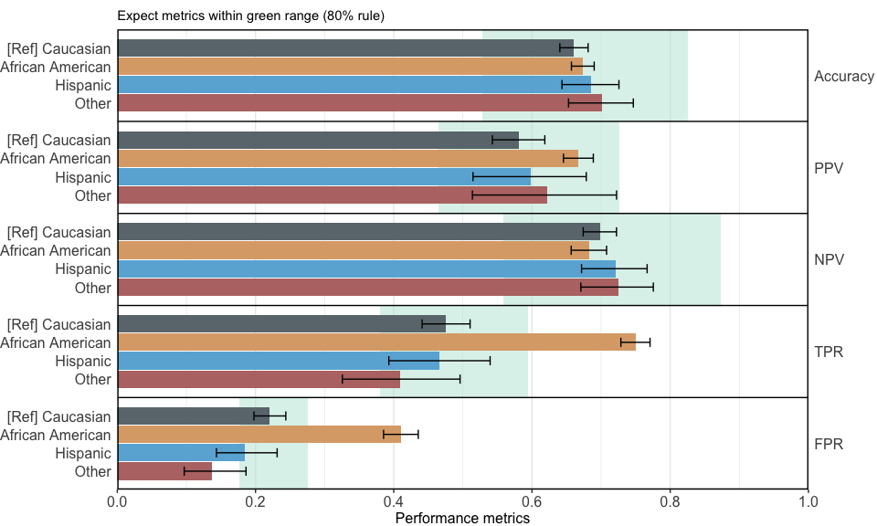<!-- -->

``` r
summary(x)
```

| Group            | TPR difference | FPR difference | TNR difference | BER difference |
|:-----------------|:---------------|:---------------|:---------------|:---------------|
| Caucasian        | Reference      | Reference      | Reference      | Reference      |
| African American | 0.274          | 0.19           | -0.19          | -0.042         |
| Hispanic         | -0.01          | -0.036         | 0.036          | -0.013         |
| Other            | -0.067         | -0.083         | 0.083          | -0.008         |

Equal opportunity ensures that different groups have the same true
positive rate (TPR), meaning the model correctly identifies positive
cases equally well across all groups. This can be assessed by comparing
the difference in TPR from the reference group across groups.
Differences close to 0 indicate minimal bias.

Equalised odds ensure that different groups have the same true positive
rate (TPR) and false positive rate (FPR), meaning the model is equally
accurate and equally prone to errors across all groups. This can be
assessed by comparing the differences in each group’s TPR and FPR from
those of a reference group across groups. Differences close to 0
indicate minimal bias.

Balanced error rate (BER) equality ensures that the BER is consistent
across different groups. BER is the average of the false positive rate
(FPR) and the false negative rate (FNR, which is 1 minus the true
positive rate \[TPR\]). This means the model’s overall error rate,
considering both false positives and false negatives, is uniform across
all groups. This can be assessed by comparing the difference in each
group’s BER from that of the reference group across groups. Differences
close to 0 indicate minimal bias.

### Individual plots

``` r
x_plots$`Performance metrics`
```

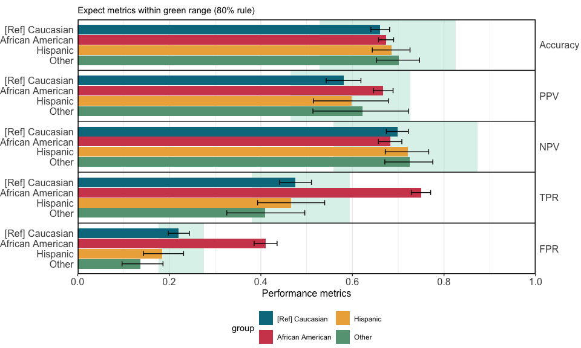<!-- -->

``` r
x_plots$`ROC curves`
```

<!-- -->

``` r
x_plots$`Calibration in the large`
```

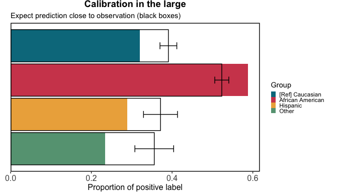<!-- -->

``` r
x_plots$`Calibration curves`
```

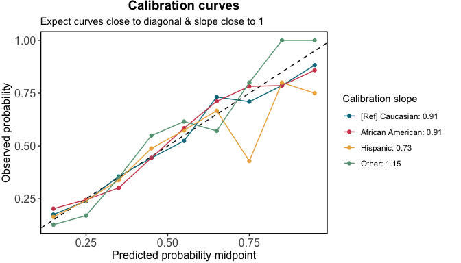<!-- -->

``` r
x_plots$`Boxplot of predictions`
```

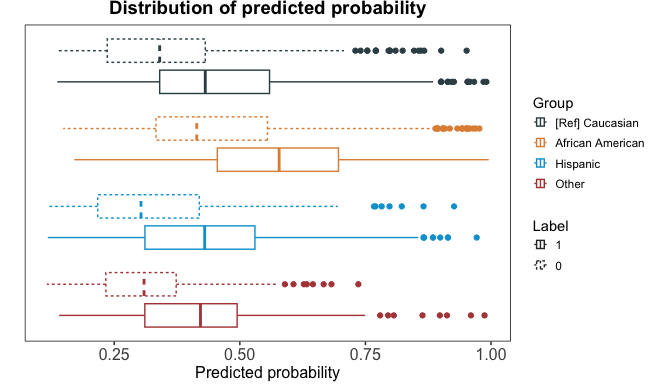<!-- -->

``` r
x_plots$`Number needed for true positive`
```

<!-- -->

``` r
x_plots$`Number needed for true negative`
```

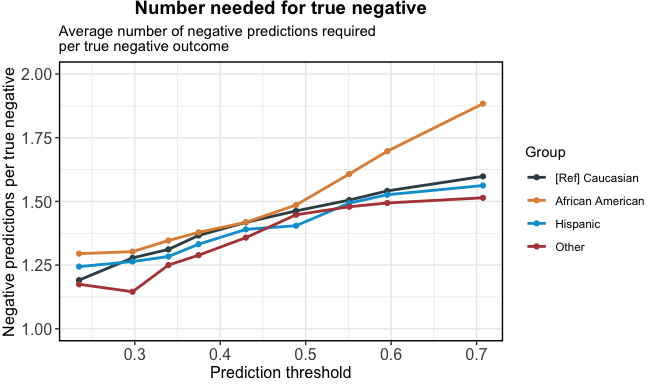<!-- -->

User define color scheme:

``` r
x_plots$`Performance metrics` + ggsci::scale_fill_npg()
## Scale for fill is already present.
## Adding another scale for fill, which will replace the existing scale.
```

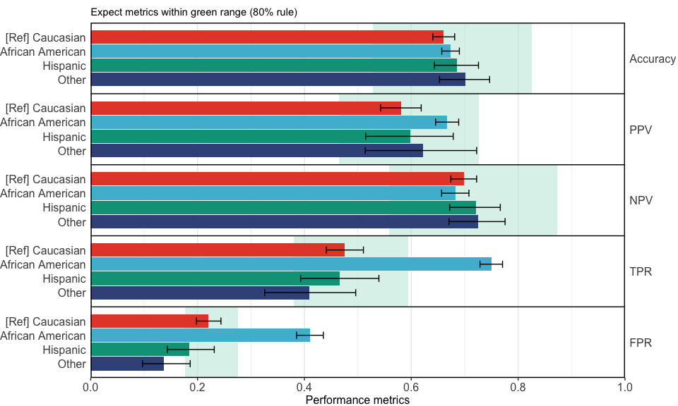<!-- -->

``` r
x_plots$`ROC curves` + ggsci::scale_color_npg()
## Scale for colour is already present.
## Adding another scale for colour, which will replace the existing scale.
```

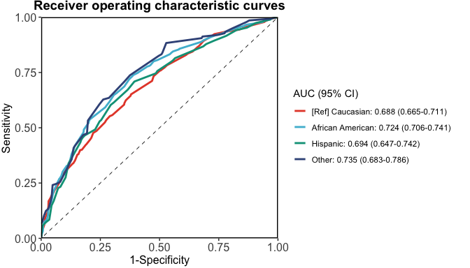<!-- -->

``` r
x_plots$`Calibration in the large` + ggsci::scale_fill_npg()
## Scale for fill is already present.
## Adding another scale for fill, which will replace the existing scale.
```

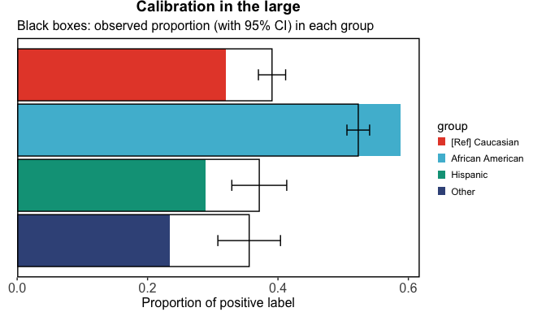<!-- -->

``` r
x_plots$`Calibration curves` + ggsci::scale_color_npg()
## Scale for colour is already present.
## Adding another scale for colour, which will replace the existing scale.
```

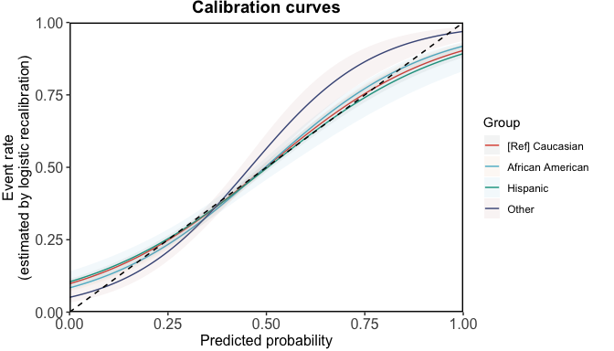<!-- -->

``` r
x_plots$`Boxplot of predictions` + ggsci::scale_color_npg()
## Scale for colour is already present.
## Adding another scale for colour, which will replace the existing scale.
```

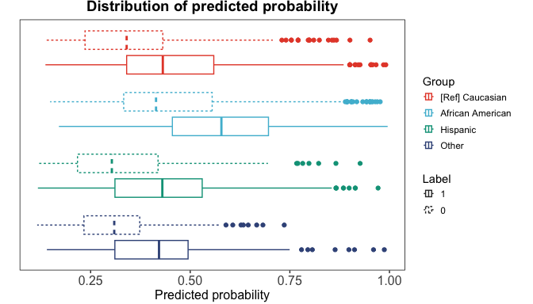<!-- -->

``` r
x_plots$`Number needed for true positive` + ggsci::scale_color_npg()
## Scale for colour is already present.
## Adding another scale for colour, which will replace the existing scale.
```

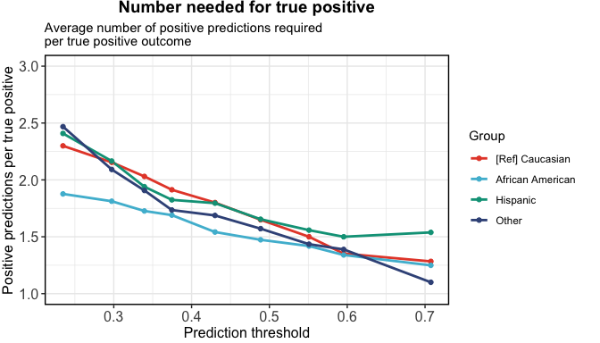<!-- -->

``` r
x_plots$`Number needed for true negative` + ggsci::scale_color_npg()
## Scale for colour is already present.
## Adding another scale for colour, which will replace the existing scale.
```

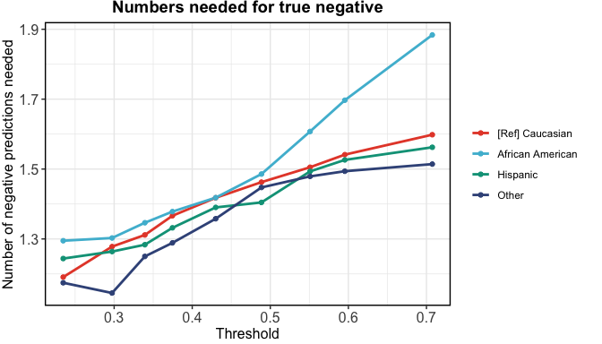<!-- -->

## Multiple sensitive variables

``` r
x2 <- evaluate_prediction_prob(
  y_pred = predict(m, newdata = compas, type = "response"), 
  y_obs = compas$Two_yr_Recidivism, y_pos = "1",
  sens_var = cbind(as.character(compas$Ethnicity), as.character(compas$Sex)), 
  sens_var_ref = c("Caucasian", "Male")
)
## Threshold=0.455 set by ROC analysis.
## Configuring sensitive variables ...
##     8 subgroups based on sensitive variables ('sens_var'): African American & Female, Caucasian & Female, Hispanic & Female, Other & Female, African American & Male, Caucasian & Male, Hispanic & Male, Other & Male.
##     Reference group: Caucasian & Male.
## Configuration completed.
table(x2$input$data$sens_var, x2$input$data$y_obs)
##                            
##                                0    1
##   [Ref] Caucasian & Male     969  652
##   African American & Female  346  203
##   African American & Male   1168 1458
##   Caucasian & Female         312  170
##   Hispanic & Female           56   26
##   Hispanic & Male            264  163
##   Other & Female              48   14
##   Other & Male               200  123
x_plots2 <- plot(x2, print_statistics = FALSE)
```

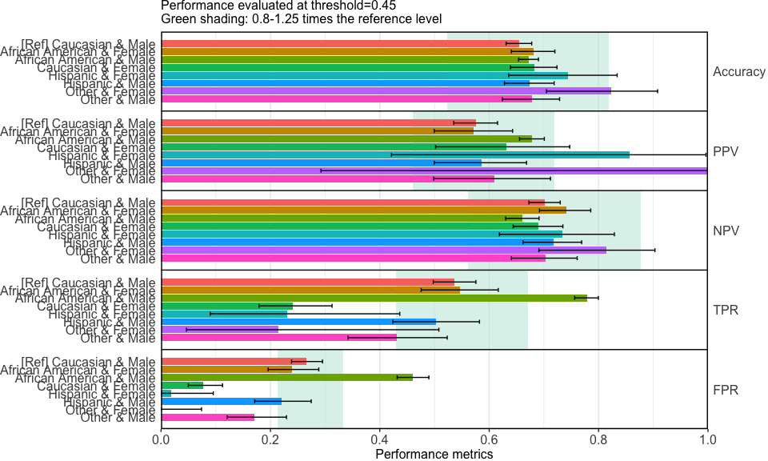<!-- -->

``` r
summary(x2)
```

| Group                     | TPR difference | FPR difference | TNR difference | BER difference |
|:--------------------------|:---------------|:---------------|:---------------|:---------------|
| Caucasian & Male          | Reference      | Reference      | Reference      | Reference      |
| African American & Female | 0.01           | -0.026         | 0.026          | -0.018         |
| African American & Male   | 0.242          | 0.194          | -0.194         | -0.024         |
| Caucasian & Female        | -0.296         | -0.189         | 0.189          | 0.053          |
| Hispanic & Female         | -0.306         | -0.248         | 0.248          | 0.029          |
| Hispanic & Male           | -0.034         | -0.047         | 0.047          | -0.006         |
| Other & Female            | -0.323         | -0.266         | 0.266          | 0.028          |
| Other & Male              | -0.106         | -0.096         | 0.096          | 0.005          |

Equal opportunity ensures that different groups have the same true
positive rate (TPR), meaning the model correctly identifies positive
cases equally well across all groups. This can be assessed by comparing
the difference in TPR from the reference group across groups.
Differences close to 0 indicate minimal bias.

Equalised odds ensure that different groups have the same true positive
rate (TPR) and false positive rate (FPR), meaning the model is equally
accurate and equally prone to errors across all groups. This can be
assessed by comparing the differences in each group’s TPR and FPR from
those of a reference group across groups. Differences close to 0
indicate minimal bias.

Balanced error rate (BER) equality ensures that the BER is consistent
across different groups. BER is the average of the false positive rate
(FPR) and the false negative rate (FNR, which is 1 minus the true
positive rate \[TPR\]). This means the model’s overall error rate,
considering both false positives and false negatives, is uniform across
all groups. This can be assessed by comparing the difference in each
group’s BER from that of the reference group across groups. Differences
close to 0 indicate minimal bias.

``` r
x_plots2$`ROC curves`
```

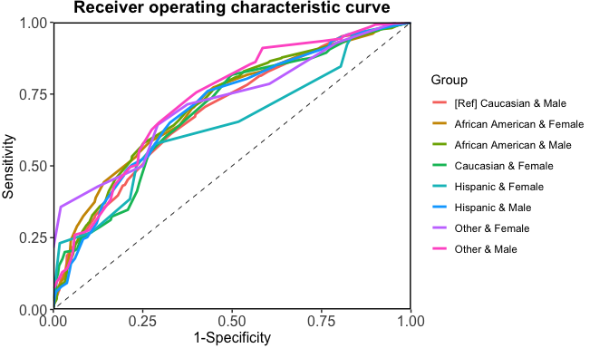<!-- -->

``` r
x_plots2$`Calibration in the large`
```

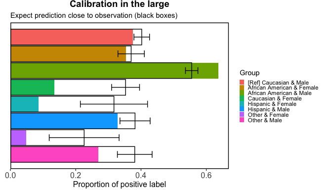<!-- -->

``` r
x_plots2$`Calibration curves`
```

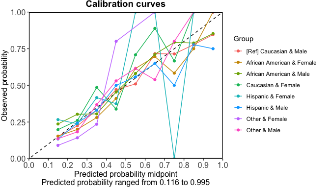<!-- -->

``` r
x_plots2$`Boxplot of predictions`
```

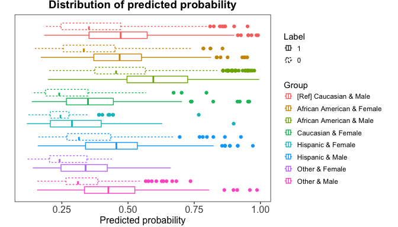<!-- -->

``` r
x_plots2$`Number needed for true positive`
## Warning: Removed 1 row containing missing values or values outside the scale range
## (`geom_line()`).
## Warning: Removed 1 row containing missing values or values outside the scale range
## (`geom_point()`).
```

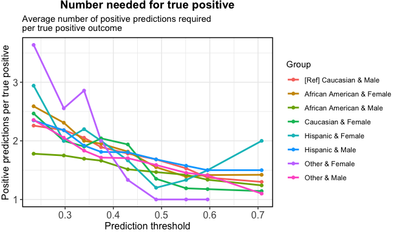<!-- -->

``` r
x_plots2$`Number needed for true negative`
```

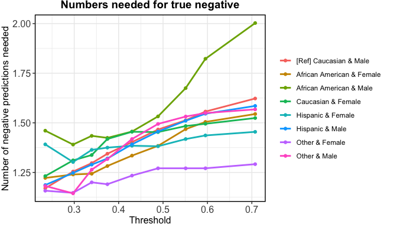<!-- -->

## Specify predicted scores

``` r
x3 <- evaluate_prediction_score(
  y_pred = predict(m, newdata = compas), 
  y_obs = compas$Two_yr_Recidivism, y_pos = "1",
  sens_var = cbind(as.character(compas$Ethnicity), as.character(compas$Sex)), 
  sens_var_ref = c("Caucasian", "Male")
)
## Threshold=-0.181 set by ROC analysis.
## Configuring sensitive variables ...
##     8 subgroups based on sensitive variables ('sens_var'): African American & Female, Caucasian & Female, Hispanic & Female, Other & Female, African American & Male, Caucasian & Male, Hispanic & Male, Other & Male.
##     Reference group: Caucasian & Male.
## Configuration completed.
table(x3$input$data$sens_var, x3$input$data$y_obs)
##                            
##                                0    1
##   [Ref] Caucasian & Male     969  652
##   African American & Female  346  203
##   African American & Male   1168 1458
##   Caucasian & Female         312  170
##   Hispanic & Female           56   26
##   Hispanic & Male            264  163
##   Other & Female              48   14
##   Other & Male               200  123
x_plots3 <- plot(x3, print_statistics = FALSE)
```

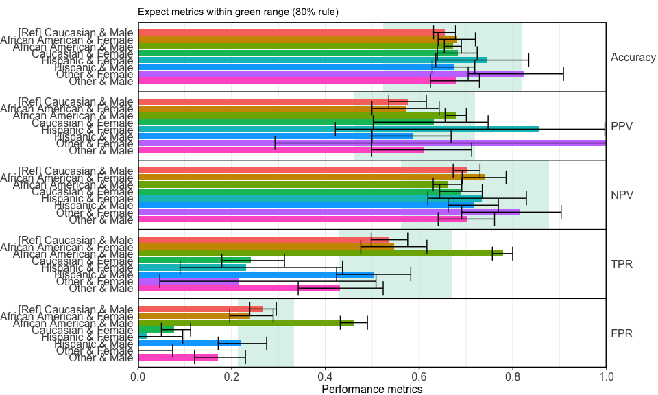<!-- -->

``` r
summary(x3)
```

| Group                     | TPR difference | FPR difference | TNR difference | BER difference |
|:--------------------------|:---------------|:---------------|:---------------|:---------------|
| Caucasian & Male          | Reference      | Reference      | Reference      | Reference      |
| African American & Female | 0.01           | -0.026         | 0.026          | -0.018         |
| African American & Male   | 0.242          | 0.194          | -0.194         | -0.024         |
| Caucasian & Female        | -0.296         | -0.189         | 0.189          | 0.053          |
| Hispanic & Female         | -0.306         | -0.248         | 0.248          | 0.029          |
| Hispanic & Male           | -0.034         | -0.047         | 0.047          | -0.006         |
| Other & Female            | -0.323         | -0.266         | 0.266          | 0.028          |
| Other & Male              | -0.106         | -0.096         | 0.096          | 0.005          |

Equal opportunity ensures that different groups have the same true
positive rate (TPR), meaning the model correctly identifies positive
cases equally well across all groups. This can be assessed by comparing
the difference in TPR from the reference group across groups.
Differences close to 0 indicate minimal bias.

Equalised odds ensure that different groups have the same true positive
rate (TPR) and false positive rate (FPR), meaning the model is equally
accurate and equally prone to errors across all groups. This can be
assessed by comparing the differences in each group’s TPR and FPR from
those of a reference group across groups. Differences close to 0
indicate minimal bias.

Balanced error rate (BER) equality ensures that the BER is consistent
across different groups. BER is the average of the false positive rate
(FPR) and the false negative rate (FNR, which is 1 minus the true
positive rate \[TPR\]). This means the model’s overall error rate,
considering both false positives and false negatives, is uniform across
all groups. This can be assessed by comparing the difference in each
group’s BER from that of the reference group across groups. Differences
close to 0 indicate minimal bias.

``` r
x_plots3$`ROC curves`
```

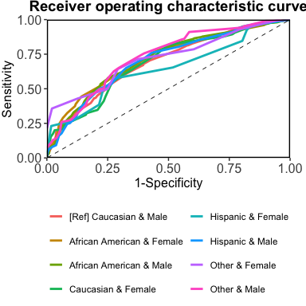<!-- -->

``` r
x_plots3$`Calibration in the large`
```

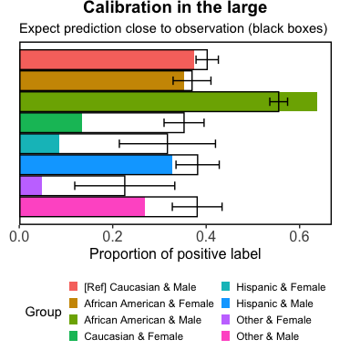<!-- -->

``` r
x_plots3$`Calibration curves`
```

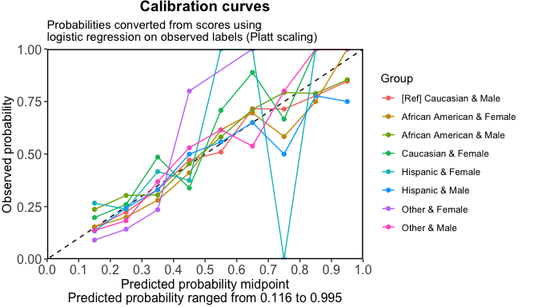<!-- -->

``` r
x_plots3$`Boxplot of predictions`
```

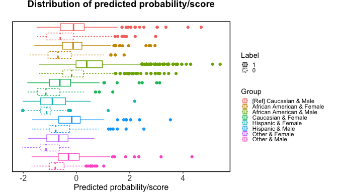<!-- -->

``` r
x_plots3$`Number needed for true positive`
## Warning: Removed 1 row containing missing values or values outside the scale range
## (`geom_line()`).
## Warning: Removed 1 row containing missing values or values outside the scale range
## (`geom_point()`).
```

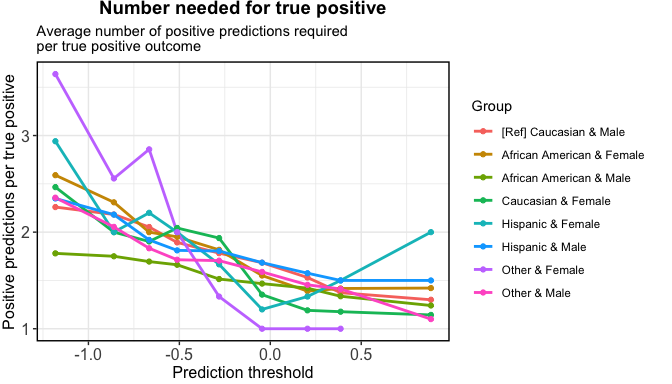<!-- -->

``` r
x_plots3$`Number needed for true negative`
```

<!-- -->
